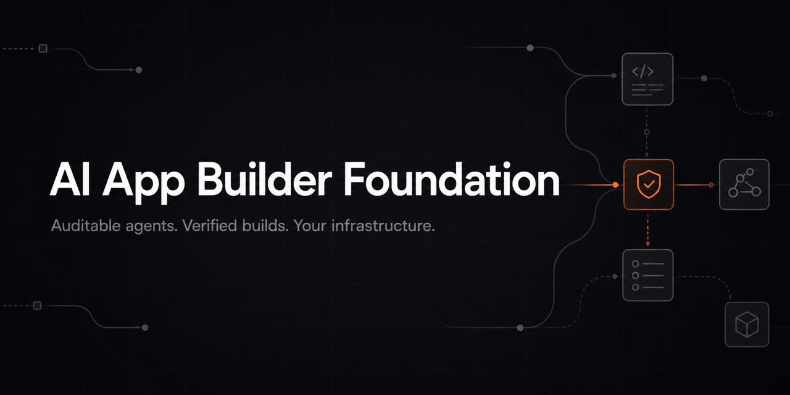
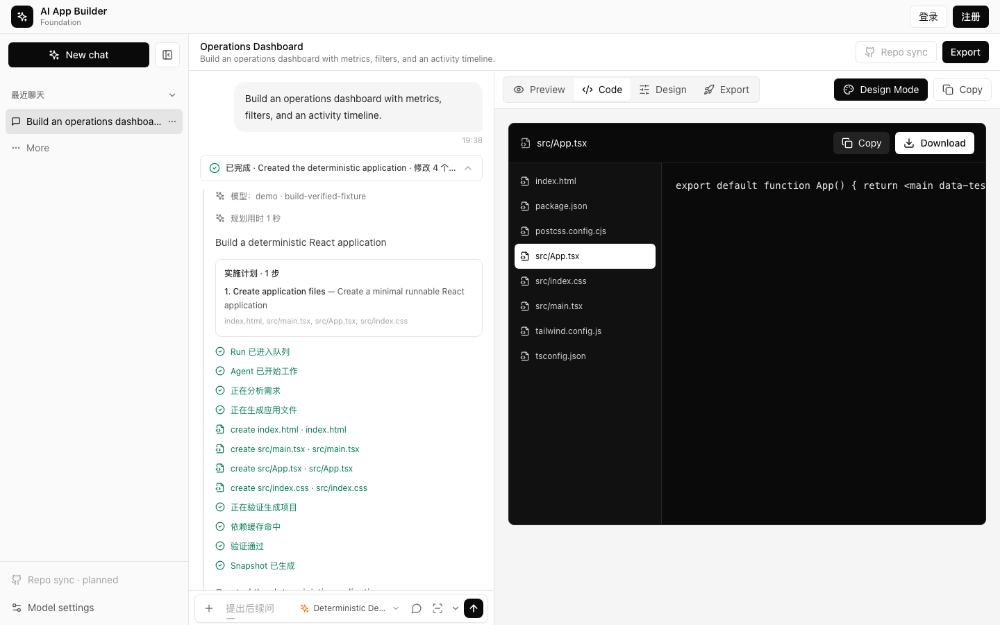

# AI App Builder Foundation

[](https://github.com/leedj8886/ai-app-builder-foundation/actions/workflows/ci.yml)
[](LICENSE)



帮助开发团队搭建自己的 AI App Builder：一个开源、可自托管的平台底座，内置可审计 Agent、真实构建验证、项目快照和定向错误恢复。

**不只是生成代码，而是生成能够通过真实构建的代码。**

*Your platform. Your models. Your infrastructure. Code that actually builds.*

[快速开始](#快速开始) · [系统架构](docs/architecture.md) ·
[故障排查](docs/troubleshooting.md) · [路线图](ROADMAP.md) ·
[模型管理](docs/model-management.md) ·
[参与贡献](CONTRIBUTING.md) ·
[获取支持](SUPPORT.md) ·
[Preview Release 草稿](docs/releases/v0.1.0-preview.1.md)

[](docs/assets/community-preview/demo.mp4)

*24 秒真实产品导览：选择模型 → 可审计 Run → 代码与 Preview → 明确的导出边界。演示使用[确定性模型 fixture](docs/community-demo.md)，不调用真实 Provider。*

## 为什么做这个项目

多数 AI App Builder 在模型输出代码后就宣布完成。本项目把 prompt-to-app 能力放入一个可审计、可恢复的执行流程：

`规划 → 生成 → 安装依赖 → 类型检查 → 生产构建 → 诊断 → 修复 → 快照`

只有生成项目通过验证后，运行才会完成并生成可预览快照。失败会被分类为代码错误、依赖错误或基础设施错误，以便定向修复或重试。

## 设计原则

- **TypeScript Native：** Web、API、Agent Runtime、工具协议和共享类型使用统一的 TypeScript 技术栈，便于 Web 团队理解、调试和改造。
- **Framework-Agnostic Core：** 模型调用、工具循环、状态流转、事件、快照和验证能力基于项目自身的清晰接口；核心不依赖 LangChain、LangGraph、AI SDK 等应用层 Agent 框架。
- **集成而不绑定：** 团队可以在核心边界之外接入第三方框架或内部 Agent 平台，并将它们维护为独立、可选的 Adapter。

这让团队能够控制关键运行路径、替换模型和基础设施，并按自己的设计系统、代码规范与部署环境进行私有化改造。

## 适合谁

- 为组织建设内部 AI 开发平台的团队
- 构建垂直 AI App Builder 的创业者
- 需要自托管和可扩展 prompt-to-app 环境的开发者
- 研究 Coding Agent 可靠性与恢复架构的工程师

如果你只想立即使用成熟的消费级 AI App Builder，本项目当前并不以替代其全部产品体验为目标。

## 核心能力

- **构建验证：** 结构、依赖、TypeScript 和生产构建分层校验。
- **定向恢复：** 区分代码、依赖和基础设施问题，避免盲目重新生成。
- **可审计 Agent：** BullMQ Worker 异步执行，SSE 实时展示持久化事件。
- **项目快照：** 保存通过验证的完整文件树，支持多轮修改和回滚。
- **多用户平台：** JWT 认证、项目、对话和用户隔离。
- **自托管：** React、Express、MongoDB、Redis、Nginx 和 Docker Compose。

## 快速开始

### 前置条件

- Docker Desktop 或 Docker Engine + Compose v2
- 一个可用的 DeepSeek API Key

### 启动

```bash
cp .env.example .env
```

编辑 `.env`，至少填写：

```dotenv
DEEPSEEK_API_KEY=your-key
JWT_SECRET=replace-with-a-random-secret
MONGO_ROOT_PASSWORD=replace-with-a-local-password
```

然后启动：

```bash
docker compose up --build
```

访问：

- Web：http://localhost:3000
- API 健康检查：http://localhost:3001/health

查看状态和日志：

```bash
docker compose ps
docker compose logs -f server worker
```

停止服务：

```bash
docker compose down
```

需要同时删除本地 MongoDB 数据和验证缓存时，明确运行：

```bash
docker compose down --volumes
```

该命令会删除 Compose 创建的数据卷，请先确认本地数据不再需要。

## 手动开发

本地开发需要 Node.js 22.19 或更高版本。

```bash
npm install
cp apps/server/.env.example apps/server/.env
cp apps/web/.env.example apps/web/.env
docker compose up -d mongodb redis
npm run dev
```

另开终端启动 Worker：

```bash
npm run worker --workspace @ai-app-builder-foundation/server
```

手动开发模式下 Web 默认位于 `http://localhost:5173`。

## 验证

```bash
npm run test:readiness
npm run test --workspace @ai-app-builder-foundation/server
npm run test --workspace @ai-app-builder-foundation/web
npm run build
```

完整 Docker Smoke：

```bash
npm run test:smoke
```

Smoke Worker 使用确定性的 FakeModelClient，不调用真实模型，不产生模型费用。

## 系统组成

| 组件 | 职责 |
|---|---|
| Web | 对话、执行时间线、代码和快照预览 |
| API Server | 认证、项目、对话、Agent Run 和 SSE |
| MongoDB | 用户、项目、Run、Event 和 Snapshot |
| Redis/BullMQ | Agent 队列和实时事件通道 |
| Agent Worker | 规划、生成、验证、修复和持久化 |
| Validation Executor | 可切换的 Worker 本地或 Sandbox 构建校验 |
| ArtifactStore | Snapshot、Validation Candidate、Verified Preview Build 和 Sandbox hydration 来源 |
| SandboxService | Build Lease、Provider、配额和受控命令编排 |

完整数据流和扩展点见[系统架构](docs/architecture.md)。

## 模型配置

模型目录由部署者管理，浏览器只接收脱敏后的模型 ID、名称和 Provider。Project
保存应用默认模型，每次 Run 也可以显式覆盖；Worker 按 Run 中已解析的模型 ID
选择客户端。示例配置提供两个 DeepSeek-compatible 模型：

```dotenv
DEEPSEEK_API_KEY=
DEEPSEEK_BASE_URL=https://api.deepseek.com
DEEPSEEK_MODEL=deepseek-v4-flash
AGENT_MODEL=
AGENT_DEFAULT_MODEL_ID=deepseek-flash
# AGENT_MODELS_JSON 的完整、可复制示例见 .env.example
```

未设置 `AGENT_MODELS_JSON` 时，系统继续兼容 `AGENT_MODEL → DEEPSEEK_MODEL`
的单模型配置。模型目录格式、多 Provider 部署和应用绑定方式见[模型管理](docs/model-management.md)。

## 当前限制

- 当前模型传输支持 OpenAI-compatible Chat Completions；原生非兼容 Provider 仍需 Adapter。
- 生成目标聚焦 React + TypeScript；样式能力会从文件、依赖和配置自动识别，
  项目元数据只作为弱提示。
- 构建通过不代表生成代码已通过业务、安全或合规审计。
- 尚未提供公开在线 Demo 和一键云部署。
- 当前包名仍属预发布身份，稳定版前可能调整。
- 完整 Docker Smoke 已覆盖 API、旧样式数据、浏览器生成与快照恢复，并纳入 CI。
  全量依赖审计只剩 React Router RSC Mode 公告，当前客户端路由架构不启用该执行路径；
  精确例外与退出条件见[依赖审计说明](docs/security/audit-v0.1.0-preview.1.md)。

## Workspace、Branch 与 Artifact

新项目使用 Workspace 作为租户边界。一个 Project 可以关联多个 Chat，每个 Chat
绑定一个 ProjectBranch，并以独立的 Snapshot Head 演进。新项目不需要存量迁移；
如需从早期开发数据库升级，可在停止 API Server 和 Worker、备份 MongoDB 后执行：

```bash
npm run build --workspace @ai-app-builder-foundation/server
npm run start:migrate:workspace-branches --workspace @ai-app-builder-foundation/server
```

ProjectSnapshot、ValidationCandidate 和经过验证的 Preview Build 不保存在 MongoDB 中。
MongoDB 只保存 Manifest 和 `artifactId`，Blob 保存在 API、Worker 和运维任务共同
挂载的 ArtifactStore。Compose 已配置共享 `artifact_store` volume。一次性清理：

```bash
docker compose --profile maintenance run --rm artifact-reconciler
```

非 `terminated` SandboxLease 会保护其源 Artifact 不被回收。

## Sandbox 校验执行器

当前包含 provider-neutral Sandbox Core、Fake Provider、仅限开发测试的
LocalProcessProvider、生产可用的 Daytona Build Provider、持久化 Lease、
Redis 配额调度、Artifact hydration 和 Sandbox Reconciler。选择 sandbox
executor 的 Worker 会在启动时先执行一次
Reconcile，之后按 `SANDBOX_RECONCILE_INTERVAL_MS` 周期恢复或回收 Lease；
Redis 不可用时，新预留 fail closed。

以下 Lease 状态占用 Project/Workspace 配额：`reserved`、`provisioning`、
`ready`、`running`、`terminating`。每个 Branch 最多一个占用配额的 Build
Sandbox。

Agent Worker 通过 `AGENT_VALIDATION_EXECUTOR` 选择校验路径：

```dotenv
# 默认值：保留 Worker 进程内的现有真实校验
AGENT_VALIDATION_EXECUTOR=legacy

# 通过 SandboxService 创建 Build Lease 并依次执行
# install、type-check、build
AGENT_VALIDATION_EXECUTOR=sandbox
```

`SANDBOX_PROVIDER=fake` 只验证编排，结果明确标记为 `simulated`，不能生成
“构建已验证”的 Snapshot。手动开发可以同时设置
`SANDBOX_PROVIDER=local` 和 `SANDBOX_LOCAL_ENABLED=true`，使用
LocalProcessProvider 完成标记为 `verified` 的本机真实构建。生产环境禁止
local，配置错误会使 Worker 启动失败。

生产 Build Sandbox 可使用 Daytona：

```dotenv
AGENT_VALIDATION_EXECUTOR=sandbox
SANDBOX_PROVIDER=daytona
DAYTONA_API_KEY=...
# 自托管时指向 Daytona API；Daytona Cloud 保持相同 Provider 协议。
DAYTONA_API_URL=https://app.daytona.io/api
DAYTONA_TARGET=
```

也可使用 `DAYTONA_JWT_TOKEN` + `DAYTONA_ORGANIZATION_ID` 认证。Daytona
资源使用 provisioning key 和规范哈希实现幂等创建与所有权校验，支持 Worker
重启后按 ID/label 重连和回收。该 Provider 目前只负责临时 Build Sandbox；
页面预览仍使用已验证的 `dist` Artifact，长驻 Daytona PreviewDeployment
属于下一阶段。

项目提供了一个默认的本地 Daytona OSS Build 栈：

```bash
cp .env.example .env
npm run daytona:init

docker compose \
  --env-file .env \
  --env-file .env.daytona \
  -f docker-compose.yml \
  -f docker-compose.daytona.yml \
  up -d daytona-api
```

在 `http://localhost:3010` 使用本地账号 `dev@daytona.io` / `password`
登录并创建 Worker API Key，将 Key 写入 `.env` 的 `DAYTONA_API_KEY`，然后：

```bash
docker compose \
  --env-file .env \
  --env-file .env.daytona \
  -f docker-compose.yml \
  -f docker-compose.daytona.yml \
  up -d --build worker
```

该 Overlay 自动把 Worker 切换到 `sandbox + daytona`，普通 Compose 默认行为
不变。完整服务清单、权限和启停说明见
[`infra/daytona/README.md`](infra/daytona/README.md)。Bundled Runner 使用
privileged 容器和本地 Dex，仅用于开发/集成；生产 Daytona 必须独立部署。

Readiness、Lease、自动删除、孤儿保护窗口、Reconcile 周期和三段构建命令超时
均通过 `SANDBOX_*` 环境变量配置。周期任务不会并发执行；Worker 退出时会等待
当前 Reconcile 安全结束。

Worker 会轮询当前 Run 状态。用户取消 Run 后，正在执行的 legacy 或 sandbox
命令会收到 `AbortSignal`；LocalProcessProvider 会终止整个进程组，Sandbox
Validator 会先回收 Build Lease，再结束本轮且不提交 Snapshot。运行中的
Sandbox 命令还会按 `SANDBOX_HEARTBEAT_INTERVAL_MS` 同时刷新 Provider 和持久
Lease 心跳；Reconciler 使用 `SANDBOX_HEARTBEAT_TIMEOUT_MS` 以 CAS 抢占并回收
失去 Worker 的陈旧 Lease，避免误杀刚刚续约的活跃构建。

Compose 默认继续使用 `legacy`；因此升级不会改变当前 Worker 的生产校验行为。
长驻 Daytona PreviewDeployment 仍属于后续阶段。

本地页面端到端验证 LocalProcessProvider 时，使用专用 Compose Override：

```bash
docker compose \
  -f docker-compose.yml \
  -f docker-compose.local-sandbox.yml \
  up -d --build worker
```

该 Override 只把 Worker 切换为开发模式下的 `sandbox + local`，MongoDB、Redis、
API、Web 和共享 ArtifactStore 仍使用主 Compose 配置。验证结束后恢复默认：

```bash
docker compose up -d --force-recreate worker
```

真实校验通过后，Worker 会把同一次构建产生的 `dist` 保存为不可变
`preview_build` Artifact。页面通过短期签名、只读、与主站隔离的 Preview Origin
加载它，并显示 `Verified build`。Fake/simulated 不会发布该 Artifact。

```dotenv
# 必须与 CLIENT_URL 不同源；生产环境应指向隔离的 Preview 域名
PREVIEW_PUBLIC_ORIGIN=http://localhost:3001
```

历史 Snapshot 没有 Preview Build 时仍回退到 Sandpack，并明确显示为 Source
Preview，而不是构建验证结果。缺少配置的旧 Tailwind Snapshot 会继续使用原有
只读兼容逻辑。

## 文档

- [系统架构](docs/architecture.md)
- [故障排查](docs/troubleshooting.md)
- [经过构建验证的 Dashboard 示例](docs/examples/verified-dashboard.md)
- [开源发布清单](docs/release-checklist.md)
- [路线图](ROADMAP.md)
- [贡献指南](CONTRIBUTING.md)
- [安全策略](SECURITY.md)

## License

Apache-2.0。详见 [LICENSE](LICENSE)。
