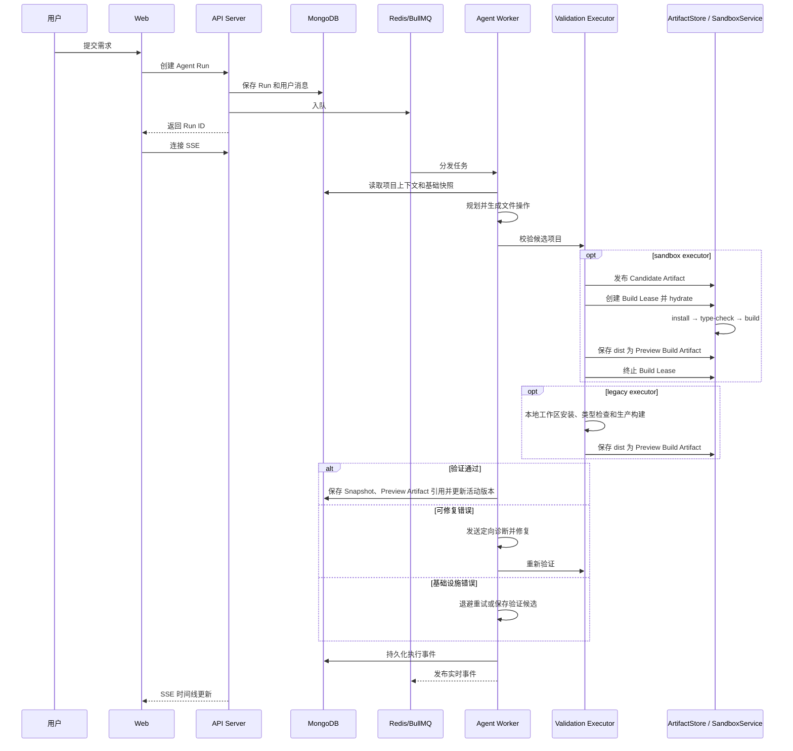

# 系统架构

## 设计目标

本项目提供“帮助团队搭建自己的 v0”所需的平台骨架，并将模型生成纳入可审计、可恢复、经过真实构建验证的执行流程。

## 组件

| 组件 | 实现 | 职责 |
|---|---|---|
| Web | React、Vite、iframe / Sandpack fallback | 提交需求、展示执行时间线、代码和快照预览 |
| Edge/Web Server | Nginx | 静态文件和同源 `/api` 反向代理 |
| API | Express、TypeScript | 认证、项目、对话、Run、Snapshot 和 SSE |
| Durable State | MongoDB | 保存用户、项目、Run、Event、Snapshot 和验证候选 |
| Queue/Event Transport | Redis、BullMQ | 异步任务和实时事件分发 |
| Agent Worker | Node.js | 规划、生成、验证、修复和持久化 |
| Validation Executor | legacy / sandbox | 选择 Worker 本地或 Sandbox 校验路径 |
| ArtifactStore | Shared filesystem | 保存不可变源码 Bundle 和 verified build output |
| Sandbox Core | SandboxService、Lease、Provider | 配额调度、工作区 hydration、固定命令和生命周期管理 |
| Preview Gateway | Express、签名 Token、隔离 Origin | 只读提供 verified Preview Artifact |

## 核心边界

核心运行路径由项目自身的 TypeScript 接口连接：

`Model Provider → Agent Runtime / Tool Registry → Run / Event State → Workspace Snapshot → Validate / Repair / Preview`

- 核心不依赖 LangChain、LangGraph、AI SDK 等应用层 Agent 框架。
- Orchestrator、状态模型和验证流水线只依赖项目自有接口，不接收厂商 SDK 或第三方框架的专有类型。
- 模型厂商、第三方框架和内部 Agent 平台通过边缘 Adapter 接入。
- 这些集成应保持为独立、可选的 Adapter，不得成为核心运行、默认构建或自托管部署的前置条件。

“框架无关”并不禁止团队使用第三方框架，而是确保团队能够替换任何边缘集成而无需重写 Open v0 的核心状态与执行流程。

## 一次生成的数据流

## 验证流程

`AGENT_VALIDATION_EXECUTOR` 默认是 `legacy`，保持现有 Worker 本地真实校验。
选择 `sandbox` 时，每轮生成或修复候选先写入 ArtifactStore，再由
SandboxService 创建 Build Lease、hydrate 文件，并严格依次执行固定的
`install`、`type-check` 和 `build` 命令。

1. **结构检查：** 在安装依赖前验证必需文件、入口和脚本。
2. **依赖准备：** 按依赖、锁文件和运行时生成指纹，复用持久缓存。
3. **类型检查：** 运行生成项目的 `type-check`。
4. **生产构建：** 运行生成项目的 `build`。
5. **错误分类：**
   - `CODE_ERROR`：允许模型定向修复源码。
   - `DEPENDENCY_ERROR`：只允许处理依赖声明。
   - `INFRA_ERROR`：退避重试，不消耗模型修复轮次。
6. **验证证据：** 真实执行结果标记为 `verified`；Fake Provider 只产生
   `simulated` 结果，不能提升为 Snapshot。
7. **预览产物：** 同一次 verified build 的 `dist` 以二进制安全 Bundle 保存；
   simulated 结果不允许发布 verified preview。
8. **快照：** 只有通过且标记为 `verified` 的候选才成为活动快照，并引用对应
   Preview Artifact。
9. **取消传播：** Worker 轮询 Run 状态并把同一个 `AbortSignal` 传入 validator
   和命令执行器；取消时终止活动进程、回收 Lease，不进入修复或 Snapshot 提交。

Preview URL 使用短期、只读、限定单个 Snapshot/Artifact 的签名 Token。
`PREVIEW_PUBLIC_ORIGIN` 必须与 `CLIENT_URL` 不同源，避免生成代码读取主站凭据。
历史 Snapshot 没有 Preview Artifact 时才回退到 Sandpack，并在界面明确标记为
Source Preview。

LocalProcessProvider 只用于手动开发和本机 PoC。生产环境检测到 local Provider
或启用开关时会 fail closed。DaytonaProvider 是首个生产 Build Provider，
负责隔离 Artifact hydration、依赖安装、类型检查和构建，并通过 provider label
支持 Worker 重启后的资源重连与回收。Daytona PreviewDeployment 尚未实现。

项目通过 `docker-compose.daytona.yml` 提供默认的本地/集成 Daytona OSS
控制面。它与应用共用 Compose 网络，但拥有独立的 PostgreSQL、Redis、Registry
和 MinIO 数据边界。Overlay 不属于生产拓扑；生产 Worker 只依赖 Daytona API
协议，通过外部 `DAYTONA_API_URL` 和最小权限 API Key 连接独立控制面。

## 一致性和恢复

- Run、Event 和 Snapshot 持久化在 MongoDB。
- SSE 先读取持久事件，再订阅实时事件。
- 客户端按 Run ID 和 sequence 去重。
- 编辑以活动快照和 revision 为基础，避免旧结果覆盖新状态。
- 基础设施重试复用已保存候选，不重新生成用户对话。
- Sandbox Worker 启动时先恢复未完成 Lease，之后以非重叠周期执行
  Reconcile；它会处理超时预留、未知创建结果、丢失资源、延迟销毁、重复资源
  和带有效所有权标签的孤儿资源。运行命令期间会同时刷新 Provider 与 MongoDB
  Lease 心跳；超过心跳超时的 running Lease 通过条件更新抢占为 terminating，
  从而恢复 Worker 异常退出，又不会基于过期读误杀刚续约的构建。
- Readiness、Lease、自动删除、孤儿保护窗口、命令心跳/超时与 Reconcile 周期
  均来自运行时配置，不在 SandboxService 中硬编码。

## 扩展点

- `apps/server/src/agent/modelClient.ts`：模型调用和结构化输出。
- `apps/server/src/agent/contextBuilder.ts`：项目上下文裁剪。
- `apps/server/src/agent/orchestrator.ts`：生成、验证和修复策略。
- `apps/server/src/agent/validator.ts`：验证流水线。
- `apps/server/src/agent/sandboxValidator.ts`：Sandbox Build Lease 校验编排。
- `apps/server/src/sandbox/provider/SandboxProvider.ts`：可替换的 Sandbox Provider 协议。
- `apps/server/src/agent/projectTemplate.ts`：默认生成技术栈。
- `apps/web/src/components/ConversationTimeline.tsx`：执行轨迹呈现。

扩展模型 Provider 时，应保持模型接口、错误脱敏和结构化结果约束，不将厂商 SDK 传播到 Orchestrator。
