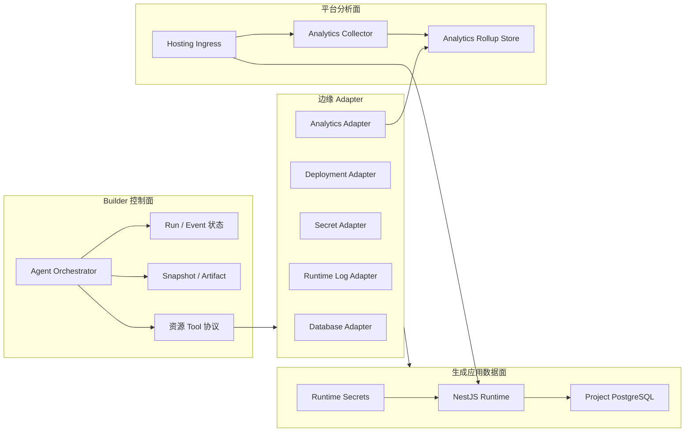
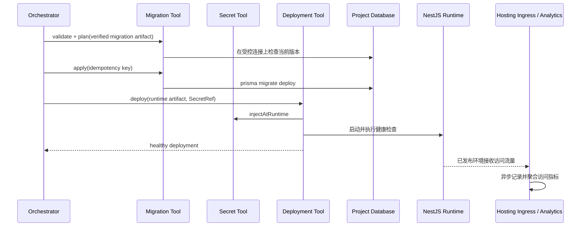

# 持久化全栈项目支持参考设计

## 文档状态

- 状态：参考设计（阶段 1 实现中）
- 范围：生成项目的数据持久化、动态运行时和资源操作边界
- 非目标：不替换 Builder 控制面的 Express API，不在阶段 1 创建持久业务数据库

本设计参考 ChatGPT Sites 的产品边界：托管平台自动采集基础访问分析，不要求生成
应用集成分析 SDK；版本保存与正式部署分离；部署访问范围与应用内身份认证分离；
持久化结构化数据、文件存储和临时展示状态按不同资源需求处理。参考：
[ChatGPT Sites 官方文档](https://learn.chatgpt.com/docs/sites?surface=app#review-site-analytics)。
这里借鉴的是产品和架构原则，不表示本项目与 Sites 的运行时或资源协议兼容。

本文定义后续实现必须遵守的架构边界。首个正式全栈 Profile 的规范名称为：

```text
fullstack-nestjs-prisma-postgres/v1
```

其默认技术栈为 React、Vite、NestJS、Prisma 和 PostgreSQL。NestJS 与 Prisma
属于“生成应用数据面”，现有 Express、MongoDB、Redis、BullMQ、Agent Worker 和
ArtifactStore 继续构成 Builder 的“平台控制面”。两者不得共用业务数据库凭据或
数据生命周期。

## 设计目标

1. 生成项目可以包含 API、关系数据库模型和持久化业务数据。
2. Preview Runtime 重启、代码重新部署后，业务数据继续存在。
3. 模型只生成业务代码和声明式资源意图，不能直接操作云厂商 SDK 或生产凭据。
4. 数据库迁移、Secret 注入和部署经过平台受控、可配置、可审计的流程。
5. 核心协议保持 Provider-neutral，Supabase、CloudBase、Neon、Kubernetes、
   Daytona 等只作为边缘 Adapter 接入。
6. 现有 `static-react/v1` 行为保持兼容；全栈能力通过显式 Profile 启用。
7. 托管平台自动提供基础访问分析，生成代码不引入第三方 Analytics SDK。
8. 保存可审查版本和对目标受众发布是两个独立动作。

## 控制面与数据面



控制面 MongoDB 只保存资源引用、期望状态、观测状态和脱敏审计信息。生成应用的
业务数据保存在项目隔离的 PostgreSQL 资源中。数据库连接串和 Secret 明文不得
进入控制面持久数据。

## Project Profile

Project Profile 负责封装生成目标的模板、文件策略、依赖、验证和运行契约，避免在
Orchestrator 中按技术栈堆积分支判断。

```ts
interface ProjectProfile {
  id: string;
  version: number;
  createTemplate(): ProjectFile[];
  editablePathPolicy(): EditablePathPolicy;
  mergePackageJson(input: PackageInput): ProjectPackageJson;
  validateStructure(files: ProjectFile[]): StructureResult;
  validationPipeline(): ValidationStage[];
  runtimeDescriptor(): RuntimeDescriptor;
}
```

Profile ID 不包含版本，例如 `fullstack-nestjs-prisma-postgres`；规范名称由
`${id}/v${version}` 组成。这样 Registry 可以精确解析版本，同时避免在 ID 和
`version` 字段中重复编码版本信息。

Snapshot Manifest 必须保存 Profile ID 和版本。Profile 升级由平台提供显式迁移，
不能让模型通过重写基础设施文件隐式完成升级。

### 生成项目建议目录

```text
apps/
  api/
    src/
      main.ts                  # 平台维护
      app.module.ts            # 平台维护
      platform/                # 平台维护
      modules/                 # Agent 可编辑
  web/
    src/                       # Agent 可编辑
prisma/
  schema.prisma                # Agent 可编辑
  migrations/                  # Agent 可编辑，但由平台验证和应用
package.json                   # 平台维护
nest-cli.json                  # 平台维护
prisma.config.ts               # 平台维护
```

NestJS Runtime 应以同源方式提供 `/api/*` 和前端构建产物，降低动态 Preview 的
CORS、Cookie 和鉴权复杂度。

## 模型可编辑边界

### 允许编辑

```text
apps/api/src/modules/**
apps/web/src/**
prisma/schema.prisma
prisma/migrations/**
```

模型主要生成：

- 业务 Module、Controller、Service 和 DTO；
- 前端页面、组件和业务状态；
- Prisma 数据模型与关系；
- 经过平台验证和审查的 SQL Migration。

### 平台维护，默认禁止编辑

- NestJS Bootstrap 与全局 Module 装配；
- PrismaService 与数据库连接初始化；
- 认证/授权骨架、全局 Guard、Pipe、Interceptor 和 Exception Filter；
- 健康检查、运行入口、构建和部署脚本；
- Secret 注入与环境配置；
- 根 `package.json`、Nest CLI 和 Prisma 平台配置。

### 强制执行

编辑边界不能只写入 Prompt，必须在平台侧强制：

1. Generation 和 Repair 共用同一套规范化路径 Allowlist。
2. 文件操作在应用前检查 Profile、操作类型和规范化后的目标路径。
3. 越权操作整体拒绝，不允许只静默忽略其中一部分。
4. 拒绝结果产生稳定错误码和脱敏 Agent Event，供模型定向修复。
5. 平台文件以模板摘要或 Manifest 完整性信息参与验证，防止间接覆盖。
6. 依赖和 scripts 由 Profile 合并，模型不能返回或修改运行命令。

建议错误码：

```text
PROFILE_PATH_DENIED
PROFILE_PLATFORM_FILE_MODIFIED
PROFILE_SCRIPT_MODIFIED
PROFILE_UNSUPPORTED_FILE_TYPE
```

## Provider-neutral 资源操作层

核心调用关系固定为：

```text
Agent / Orchestrator
  -> Database Tool
  -> Migration Tool
  -> Secret Tool
  -> Deployment Tool
  -> Runtime Log Tool
  -> Analytics Tool
      -> Provider Adapter
```

Tool 只依赖项目自有 TypeScript 协议。云厂商 SDK、BaaS 专有资源类型和 MCP
协议不得传播到 Orchestrator、Run 状态机、Project Snapshot、Artifact Manifest
或 Agent Event Schema。

### 通用调用上下文

```ts
interface ResourceScope {
  workspaceId: string;
  projectId: string;
  branchId?: string;
  environmentId: string;
}

interface ToolCallContext {
  operationId: string;
  idempotencyKey: string;
  requestedByUserId: string;
  runId?: string;
  scope: ResourceScope;
  signal?: AbortSignal;
}

interface ResourceRef {
  kind: 'database' | 'deployment' | 'secret';
  id: string;
  provider: string;
}
```

`ResourceRef.id` 是平台生成的逻辑 ID。Provider 外部 ID 只能由对应 Adapter 和
资源 Repository 使用，不能作为核心业务逻辑的分支条件。

### Database Tool

```ts
interface DatabaseTool {
  provision(input: ProvisionDatabaseInput, ctx: ToolCallContext): Promise<DatabaseResult>;
  inspect(input: InspectDatabaseInput, ctx: ToolCallContext): Promise<DatabaseStatus>;
  branch(input: BranchDatabaseInput, ctx: ToolCallContext): Promise<DatabaseResult>;
  reset(input: ResetDatabaseInput, ctx: ToolCallContext): Promise<DatabaseResult>;
  destroy(input: DestroyDatabaseInput, ctx: ToolCallContext): Promise<OperationResult>;
}
```

- `provision` 创建环境数据库或隔离 Schema。
- `branch` 从允许的数据基线创建独立数据分支。
- `reset` 必须显式指定目标和重置策略，且具备单独权限。
- `destroy` 使用延迟删除和 Reconcile，不依赖一次远程调用完成。

### Migration Tool

```ts
interface MigrationTool {
  validate(input: ValidateMigrationInput, ctx: ToolCallContext): Promise<MigrationValidation>;
  plan(input: PlanMigrationInput, ctx: ToolCallContext): Promise<MigrationPlan>;
  apply(input: ApplyMigrationInput, ctx: ToolCallContext): Promise<MigrationResult>;
  status(input: MigrationStatusInput, ctx: ToolCallContext): Promise<MigrationStatus>;
}
```

生产迁移只能通过 Migration Tool 应用。Agent 不获得生产数据库凭据，也不能在
普通命令 Sandbox 中自行执行生产迁移。

### Secret Tool

```ts
interface SecretTool {
  storeReference(input: StoreSecretInput, ctx: ToolCallContext): Promise<SecretRef>;
  injectAtRuntime(input: InjectSecretInput, ctx: ToolCallContext): Promise<InjectionResult>;
  revoke(input: RevokeSecretInput, ctx: ToolCallContext): Promise<OperationResult>;
}
```

核心只持有不透明 `SecretRef`。读取明文不是 Agent Tool 能力；运行时注入由部署
执行器和 Secret Adapter 在受控边界内完成。

### Deployment Tool

```ts
interface DeploymentTool {
  deploy(input: DeployInput, ctx: ToolCallContext): Promise<DeploymentResult>;
  promote(input: PromoteInput, ctx: ToolCallContext): Promise<DeploymentResult>;
  stop(input: StopDeploymentInput, ctx: ToolCallContext): Promise<OperationResult>;
  reconcile(input: ReconcileDeploymentInput, ctx: ToolCallContext): Promise<DeploymentStatus>;
  health(input: DeploymentHealthInput, ctx: ToolCallContext): Promise<HealthResult>;
}
```

长期 Preview 使用独立 Deployment 状态模型。底层可以复用 Sandbox Provider 的
文件、进程、Preview 和生命周期能力，但不能直接复用短期 Build Lease 的业务
语义。

### Runtime Log Tool

```ts
interface RuntimeLogTool {
  query(input: RuntimeLogQuery, ctx: ToolCallContext): Promise<SanitizedLogPage>;
}
```

查询必须按 Workspace、Project、Environment 和用户权限隔离，并在写入 Event 或
返回模型前执行 Secret、认证头、Cookie、连接串和常见个人信息脱敏。

### Analytics Tool

```ts
interface AnalyticsTool {
  summary(input: AnalyticsSummaryQuery, ctx: ToolCallContext): Promise<AnalyticsSummary>;
  series(input: AnalyticsSeriesQuery, ctx: ToolCallContext): Promise<AnalyticsSeries>;
}
```

Analytics Tool 首版只提供读取，不向 Agent 暴露原始访问事件。查询必须显式包含
ProjectEnvironment、时间范围和粒度，并经过 Workspace/Project 权限检查。默认
支持：

- 总唯一访客数；
- 总页面浏览量；
- 两项指标随时间的序列；
- 日期范围和 `hour/day/week` 粒度；
- 按 Deployment/Snapshot 归因，但默认不展示可识别访客明细。

生成应用不得直接写入 Analytics Store，也不得自行伪造平台访问指标。

## 核心资源模型

### ProjectEnvironment

表示一个 Project/Branch 的运行环境：

```text
preview | staging | production
```

保存 Profile、数据库逻辑引用、期望 Snapshot、活动 Deployment 和生命周期状态。

### DatabaseResource

保存数据库逻辑资源、Provider、外部引用、期望状态和观测状态。建议状态：

```text
provisioning -> ready -> resetting -> ready
                     -> deleting -> deleted
                     -> failed
```

连接凭据不属于该模型，只保存 `SecretRef`。

### MigrationRecord

保存：

- Migration Artifact ID；
- SQL 或迁移目录校验和；
- 来源 Snapshot 和 Profile 版本；
- 目标 DatabaseResource；
- `planned/validated/applying/applied/failed` 状态；
- 脱敏诊断和执行时间。

### AppDeployment

保存 Snapshot、Runtime Artifact、Environment、Provider、访问 URL、期望状态和
观测状态。建议状态：

```text
queued -> provisioning -> migrating -> starting -> healthy
                                             -> unhealthy
                                             -> failed
healthy -> stopping -> stopped
```

### AnalyticsDataset

一个 ProjectEnvironment 对应一个逻辑 AnalyticsDataset。数据物理上进入独立的
平台分析存储，不进入生成应用 PostgreSQL，也不随 DatabaseResource 的
`reset`、branch 或 migration 操作改变。Rollup 至少按以下维度隔离：

```text
workspaceId
projectId
environmentId
deploymentId
snapshotId
timeBucket
```

AnalyticsDataset 只保存逻辑引用、保留策略和观测状态；高基数原始事件不写入
MongoDB。

## 验证与部署流程

### 候选验证

```text
structure
-> install
-> prisma validate
-> prisma generate
-> migration history and checksum check
-> 在一次性 PostgreSQL 和 Shadow Database 上重放迁移
-> NestJS type-check
-> API integration test
-> Web + API build
-> runtime smoke test
```

验证数据库必须是一次性资源。验证阶段不能连接持久 Preview、Staging 或
Production 数据库。

阶段 1 使用 `ValidationDatabase` 控制面接口管理短期连接引用。本地和测试实现为
每轮验证启动独立的 Testcontainers PostgreSQL，同时创建 `validation_primary` 和
`validation_shadow` 两个干净数据库。连接串只在需要数据库的固定平台注册阶段中
通过 `DATABASE_URL` / `SHADOW_DATABASE_URL` 注入 Sandbox 命令环境，不进入
Artifact、Snapshot、ValidationResult 或 Agent Event。

本地 Worker 默认使用 `postgres:16-alpine`；私有镜像或镜像代理通过
`VALIDATION_DATABASE_IMAGE` 指定。远端 Sandbox 需要把
`VALIDATION_DATABASE_HOST` 配置为该 Sandbox 可达且受限的 Worker 地址，后续托管
部署应替换为实现同一接口的远端短期数据库 Adapter。验证结束、失败或取消都会调用
`destroy`；失败的清理由 `reconcile` 重试，进程异常则由 Testcontainers 的资源回收
机制兜底。

### 部署



迁移与 Runtime 启动必须分离。应用进程启动时不得自动运行
`prisma migrate dev`；Preview、Staging 和 Production 只应用已经验证并保存的
Migration Artifact。

首版不要求部署必须通过 expand/contract、历史数据兼容性或按环境区分的迁移
保护门禁。部署时采用保留现有数据并应用迁移、重置目标数据库后部署，还是取消
本次部署，由具备权限的平台用户明确选择；平台记录选择和执行结果，但不替用户
统一决定业务数据的保留策略。

### 版本保存与发布

参考 Sites 的两阶段语义，平台将“生成可审查版本”和“让目标受众访问”分开：

1. **Save Version：** 验证候选、保存 Snapshot、Runtime Artifact 和 Migration
   Artifact，不改变当前线上流量。
2. **Deploy/Promote Version：** 对指定 Environment 执行受控迁移、部署、健康检查
   和流量切换。

每次访问分析都归因到实际承载请求的 Deployment 和 Snapshot。发布失败不得污染
当前健康 Deployment 的统计归属。

## 自动访问分析

### 采集边界

基础分析由 Hosting Ingress 自动提供，不要求模型修改 `apps/web/src/**` 或安装
第三方 SDK：

- 首次文档导航由 Ingress 在响应完成后异步记录；
- SPA 客户端路由变化由平台托管、不可被模型修改的轻量 Bootstrap 记录；
- 静态和全栈 Profile 使用同一事件协议；
- 采集失败必须 fail open，不能增加站点请求失败率；
- Build、健康检查、平台探针、静态资源和已识别机器人不计入页面浏览量。

平台 Bootstrap 不得读取应用表单内容、业务数据库数据或任意 DOM 文本。首版不
提供自定义事件、会话回放、热力图或跨站广告追踪。

### 指标定义

- **Page view：** 已发布环境中成功展示 HTML 文档或完成一次 SPA 页面导航。
- **Unique visitor：** 时间范围内去重后的隐私保护 Visitor Key；指标允许是近似值。
- **Authenticated visitor：** 使用按 Workspace/Project 加盐后的主体标识，不保存
  原始邮箱或外部用户 ID。
- **Anonymous visitor：** 使用第一方、短期、不可跨项目关联的随机标识；不以原始
  IP 作为持久 Visitor Key。

产品界面必须展示统计时区、范围、粒度、数据延迟和唯一访客定义，避免把近似指标
解释成精确用户数。

### 数据处理与保留

1. Ingress 只发送最小事件：作用域、Deployment/Snapshot、时间、规范化路径、
   响应分类和隐私保护 Visitor Key。
2. 查询参数默认丢弃；敏感路径段在采集前规范化或哈希。
3. 原始 IP、认证头、Cookie、User-Agent 全文和业务请求体不得进入 Rollup Store。
4. 原始事件使用短保留期，聚合数据使用可配置保留期。
5. 删除 ProjectEnvironment 时先停止采集，再按保留策略删除 AnalyticsDataset。
6. Runtime Log 和 Analytics 是不同数据边界，权限和保留策略分别配置。

### 分析界面

ProjectEnvironment 的 Analytics 页面首版提供：

- 唯一访客和页面浏览量汇总卡片；
- 两项指标的时间趋势；
- 日期范围和时间粒度切换；
- 当前 Environment、Deployment 和 Snapshot 标识；
- 无数据、延迟、权限不足和 Provider 不可用状态。

Preview 默认不进入正式产品指标；可通过单独的开发流量开关查看，并始终与
Production 数据分开展示。

## 访问范围与应用身份

Deployment Audience 与生成应用内部的用户认证是两套独立控制：

```text
owner_admins | selected_members | workspace | public
```

- Audience 在 Hosting Ingress 执行，决定谁可以访问 Deployment。
- 应用认证在 NestJS 平台骨架中执行，决定访问者可以操作哪些业务数据。
- 新 Deployment 默认使用最窄访问范围，不因 `deploy` 自动公开。
- Ingress 必须剥离外部请求伪造的身份头，再写入平台签名的身份上下文。
- Controller/Service 的授权决策只能基于服务端验证后的身份上下文。
- Analytics 权限独立于访问权限；能访问站点不代表能查看站点分析。

## 迁移执行与用户决策

1. `prisma/schema.prisma` 是声明式目标，`prisma/migrations/**` 是可审查的执行历史。
2. 生成阶段可以创建迁移，但不能应用到持久环境。
3. `validate` 检查语法、历史连续性、校验和和 Profile 兼容性。
4. 候选迁移必须能在一次性 PostgreSQL 和 Shadow Database 上完整重放；验证资源
   不包含持久环境的历史业务数据，因此该结果不等同于历史数据兼容性保证。
5. `plan` 可以报告删除表/列、类型收窄、唯一约束、非空列和大表重写等风险，但
   首版不将统一的风险等级作为强制部署门禁。
6. 对持久环境执行前，平台用户明确选择保留数据并迁移、重置后部署或取消操作；
   平台不得把重置或数据丢弃隐藏在自动修复流程中。
7. `apply` 使用数据库级迁移锁、操作幂等键和条件状态更新。
8. 代码回滚不自动回滚数据库。首版是否保留数据以及是否接受不可逆变化由平台
   用户决定，平台负责展示迁移计划、目标资源和审计结果。
9. expand/contract、历史数据兼容性门禁、按环境区分的保护策略和生产迁移审批，
   作为后续远端及生产部署优化，不是首版实现的前置条件。

## Branch 与数据语义

- 一个代码 ProjectBranch 对应一个数据库分支或隔离 Schema。
- 创建 ProjectBranch 时才创建数据分支；每个 Snapshot 不复制数据库。
- Snapshot 回滚默认只切换代码，不回滚业务数据。
- Preview 数据不得默认从 Production 克隆。
- 如需从 Production 派生数据，必须经过独立授权和脱敏流程。
- Archive Branch 后先停止 Deployment，再按保留策略删除数据库分支。

Provider 不支持原生数据库分支时，Database Adapter 可以使用独立数据库、Schema
或从经过批准的 Seed Artifact 初始化，但对核心暴露相同的 `branch` 语义。

## Secret 与日志边界

Secret 明文禁止进入：

```text
Snapshot
Artifact
Agent Context
Prompt
Agent Event 正文
构建输出
Runtime Log 查询结果
```

日志脱敏至少覆盖：

- `DATABASE_URL` 和常见数据库连接串；
- API Key、Bearer Token、Cookie 和认证头；
- Secret 环境变量值；
- Provider 原始认证响应；
- Prisma 错误中可能出现的连接信息。

无法确认安全的 Provider 原始响应不得直接返回模型。

## Agent Event 审计

每次资源 Tool 调用都产生可审计 Event，但只保存规范化、脱敏后的调用摘要：

```json
{
  "type": "tool.completed",
  "tool": "migration.apply",
  "scope": {
    "workspaceId": "...",
    "projectId": "...",
    "environmentId": "..."
  },
  "resourceRef": "database:...",
  "operationId": "...",
  "status": "succeeded",
  "durationMs": 1234,
  "summary": "Applied 2 verified migrations"
}
```

Event 不保存数据库连接串、Secret、Provider 原始响应、未脱敏日志、SQL 参数或
业务查询结果。失败事件使用稳定的核心错误码，Provider 错误映射在 Adapter 边界
完成。

Analytics 查询也产生审计 Event，但 Event 只记录查询范围、粒度、时间范围和结果
行数，不复制访问序列或 Visitor Key。自动采集事件不逐条进入 Agent Event，避免
高流量污染 Run 时间线。

## Adapter 边界

首批可实现的 Adapter 组合：

| 能力 | 本地/测试 | 托管候选 |
|---|---|---|
| Database | PostgreSQL Docker / isolated schema | Neon、Supabase、CloudBase |
| Secret | 进程内测试实现 / 本地加密存储 | Kubernetes Secret、云 Secret Manager |
| Deployment | LocalProcess / Daytona Preview | Daytona、Kubernetes |
| Runtime Log | 本地受限文件读取 | Daytona、Kubernetes、云日志服务 |
| Analytics | Ingress 内存/测试 Rollup | ClickHouse、云分析存储 |

Adapter 负责认证、重试、限流、Provider 状态映射和外部资源 ID。核心负责授权、
幂等、期望状态、审计和生命周期编排。

## 分阶段落地

### 阶段 1：Profile 与静态验证

- 建立 `static-react/v1` 和 `fullstack-nestjs-prisma-postgres/v1` Profile。
- 实现模型路径 Allowlist 和平台文件完整性检查。
- 生成 NestJS + Prisma 模板。
- 在一次性 PostgreSQL 上完成 Prisma 迁移验证。
- 具体兼容策略、任务拆分和测试门槛见
  [阶段 1 实施计划](superpowers/plans/2026-08-08-fullstack-persistence-phase-1.md)。

### 阶段 2：持久 Preview

- 实现 ProjectEnvironment、DatabaseResource 和 AppDeployment。
- 实现本地 Database、Secret、Deployment、Runtime Log 和 Analytics Adapter。
- Preview 重启和重新部署后保留业务数据。
- 部署前允许平台用户选择保留数据并迁移、重置数据库或取消操作。
- 实现健康检查、停止、恢复和 Reconcile。
- 在 Hosting Ingress 自动采集唯一访客和页面浏览量，并提供基础 Analytics 页面。

### 阶段 3：数据分支与托管 Adapter

- ProjectBranch 与数据库分支绑定。
- 接入至少一个托管 Database Adapter 和一个生产 Deployment Adapter。
- 实现资源配额、延迟删除和备份边界。

### 阶段 4：生产发布

- Staging/Production Promote 流程。
- 显式迁移审批和发布审计。
- Secret 轮换、日志保留和运行告警。
- 灰度、健康回退和前后兼容迁移策略。

## 首版验收标准

1. 生成的 Todo 全栈应用使用 NestJS、Prisma 和 PostgreSQL 完成 CRUD。
2. 模型无法修改平台维护文件；Generation 和 Repair 都受到相同策略约束。
3. Preview Runtime 重启、停止后恢复或重新部署后，业务数据保持不变。
4. 不同 Workspace、Project 和 Branch 的数据及日志互相隔离。
5. 未经一次性数据库验证或超出平台用户明确选择范围的迁移操作不会触达持久
   数据库。
6. 同一个迁移或部署操作重复执行不会产生重复资源或重复应用。
7. Snapshot、Artifact、Agent Context、Event 和日志中不存在 Secret 明文。
8. Provider SDK 和专有类型不会出现在 Orchestrator、Run、Snapshot 核心接口中。
9. 已发布环境无需生成应用集成 Analytics SDK，即可查看唯一访客、页面浏览量和
   时间趋势，并能切换日期范围和粒度。
10. Analytics 不保存原始身份信息，不阻塞站点请求，并能按 Workspace、Project、
    Environment、Deployment 和 Snapshot 正确隔离与归因。
11. 保存 Snapshot 不会自动发布；发布后仍使用显式 Audience，且站点访问权限与
    Analytics 查看权限相互独立。

## 后续设计仍需确认

- 首个生产 Database Adapter 和 Deployment Adapter 的选择；
- Preview 空闲停止后的冷启动目标和数据资源保留期限；
- 数据库分支不受 Provider 原生支持时的成本与容量策略；
- 后续生产部署中破坏性迁移的审批角色和交互方式；
- Production 数据脱敏副本是否进入首个正式版本；
- Analytics 原始事件和聚合数据的默认保留期；
- 唯一访客在严格隐私模式下采用精确去重还是近似去重；
- 首个生产 Analytics Adapter 和数据驻留策略。
