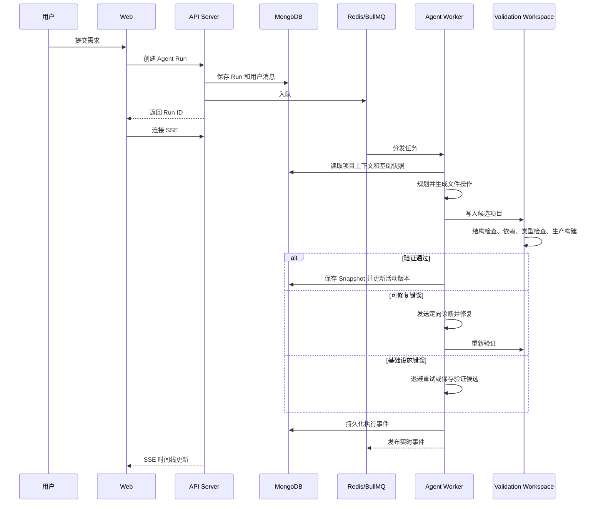

# Open v0 开源发布基线实施计划

> **For agentic workers:** REQUIRED SUB-SKILL: Use superpowers:subagent-driven-development (recommended) or superpowers:executing-plans to implement this plan task-by-task. Steps use checkbox (`- [ ]`) syntax for tracking.

**目标：** 在保留当前工作名称和产品代码的前提下，建立可验证的开源发布基线，使外部开发者能够理解、启动、验证并参与这个“帮助团队搭建自己的 v0”的平台底座。

**架构：** 本阶段不重构 Agent 或前端产品功能，而是在仓库外围建立四层发布能力：开源治理文件、可复现环境配置、面向平台建设者的 README/架构文档、可执行的发布验收。使用一个轻量 Node 测试守护必需文件、配置键和文档链接，并继续用现有单元测试、生产构建和 Docker Smoke 测试验证真实系统。

**技术栈：** Markdown、Apache-2.0、Docker Compose、Node.js 20、TypeScript、Node test runner、React/Vite、Express、MongoDB、Redis/BullMQ、Nginx。

---

## 范围说明

本计划只交付可以独立验收的“开源发布基线”。以下工作拆到后续独立计划：

- 正式品牌命名和仓库/package 全量重命名。
- 失败—诊断—修复—构建成功的演示录制。
- 在线 Demo 和一键云部署。
- GitHub description、topics、social preview、Release 发布等外部写操作。
- Reddit、Show HN、V2EX、X、B站等渠道投放。

这些内容仍属于已批准设计稿的发布必需项，但不应在正式名称尚未决定、基础启动链路尚未通过外部验证前与本计划混合实施。

## 文件结构

### 新增文件

- `LICENSE`：Apache-2.0 完整许可证。
- `CONTRIBUTING.md`：贡献流程、开发验证和提交边界。
- `SECURITY.md`：安全问题报告方式与部署安全边界。
- `ROADMAP.md`：面向平台建设者的公开路线图。
- `.env.example`：Docker Compose 默认启动使用的根环境变量模板。
- `docs/architecture.md`：平台组件、数据流和扩展点。
- `docs/troubleshooting.md`：安装、模型、队列和验证问题排查。
- `docs/examples/verified-dashboard.md`：可复现的首次生成与修改示例。
- `docs/release-checklist.md`：从本地验证到公开 Release 的发布清单。
- `tests/repository/open-source-readiness.test.ts`：仓库开源准备自动检查。
- `.github/ISSUE_TEMPLATE/bug_report.yml`：结构化 Bug 报告模板。
- `.github/ISSUE_TEMPLATE/feature_request.yml`：面向平台能力的需求模板。
- `.github/ISSUE_TEMPLATE/config.yml`：关闭空白 Issue，链接安全报告。
- `.github/PULL_REQUEST_TEMPLATE.md`：PR 自检模板。

### 修改文件

- `package.json`：增加 `test:readiness`。
- `apps/server/.env.example`：移除失效的 OpenAI 配置，补齐 DeepSeek、Redis 和 Agent 配置。
- `apps/web/.env.example`：说明仅手动开发时需要 `VITE_API_URL`。
- `docker-compose.yml`：统一环境变量、健康检查、启动依赖、端口和 Worker 验证缓存。
- `README.md`：改写为面向“搭建自己的 v0”的中文落地页。

### 明确不修改

- `apps/server/src/agent/orchestrator.ts`
- `apps/server/src/agent/orchestrator.test.ts`
- `apps/web/src/components/ConversationTimeline.tsx`
- `apps/web/src/lib/chatTimeline.ts`
- `apps/web/src/lib/chatTimeline.test.ts`
- `.superpowers/`

以上是当前工作区中的既有未提交改动，本计划所有提交必须避开它们。

## Task 1：建立开源治理文件和自动准备度检查

**文件：**

- 新增：`LICENSE`
- 新增：`CONTRIBUTING.md`
- 新增：`SECURITY.md`
- 新增：`ROADMAP.md`
- 新增：`tests/repository/open-source-readiness.test.ts`
- 修改：`package.json`

- [ ] **Step 1：为治理文件编写失败测试**

创建 `tests/repository/open-source-readiness.test.ts`：

```ts
import assert from 'node:assert/strict';
import { access, readFile } from 'node:fs/promises';
import { test } from 'node:test';
import path from 'node:path';
import { fileURLToPath } from 'node:url';

const repositoryRoot = path.resolve(
  path.dirname(fileURLToPath(import.meta.url)),
  '../..'
);

const repositoryFile = (relativePath: string): string =>
  path.join(repositoryRoot, relativePath);

test('repository contains the approved open-source governance files', async () => {
  const requiredFiles = [
    'LICENSE',
    'CONTRIBUTING.md',
    'SECURITY.md',
    'ROADMAP.md'
  ];

  await Promise.all(
    requiredFiles.map(relativePath => access(repositoryFile(relativePath)))
  );

  const license = await readFile(repositoryFile('LICENSE'), 'utf8');
  assert.match(license, /Apache License\s+Version 2\.0, January 2004/);
  assert.match(license, /http:\/\/www\.apache\.org\/licenses\//);

  const contributing = await readFile(
    repositoryFile('CONTRIBUTING.md'),
    'utf8'
  );
  assert.match(contributing, /npm run test:readiness/);
  assert.match(contributing, /npm run test:smoke/);

  const security = await readFile(repositoryFile('SECURITY.md'), 'utf8');
  assert.match(security, /不要在公开 Issue 中披露/);

  const roadmap = await readFile(repositoryFile('ROADMAP.md'), 'utf8');
  assert.match(roadmap, /帮助团队搭建自己的 v0/);
});
```

在根 `package.json` 的 `scripts` 中加入：

```json
"test:readiness": "node --import tsx --test tests/repository/open-source-readiness.test.ts"
```

- [ ] **Step 2：运行测试并确认失败**

运行：

```bash
npm run test:readiness
```

预期：FAIL，错误指向缺失的 `LICENSE`、`CONTRIBUTING.md`、`SECURITY.md` 或 `ROADMAP.md`。

- [ ] **Step 3：加入 Apache-2.0 License**

使用 `apply_patch` 创建 `LICENSE`，内容必须是 Apache Software Foundation 发布的、未经修改的 Apache License 2.0 正文。使用以下开头和结尾核对完整性：

```text
                                 Apache License
                           Version 2.0, January 2004
                        http://www.apache.org/licenses/

   TERMS AND CONDITIONS FOR USE, REPRODUCTION, AND DISTRIBUTION
```

许可证正文必须完整包含第 1–9 节以及以下结尾：

```text
   END OF TERMS AND CONDITIONS

   APPENDIX: How to apply the Apache License to your work.

   Copyright [yyyy] [name of copyright owner]

   Licensed under the Apache License, Version 2.0 (the "License");
   you may not use this file except in compliance with the License.
   You may obtain a copy of the License at

       http://www.apache.org/licenses/LICENSE-2.0

   Unless required by applicable law or agreed to in writing, software
   distributed under the License is distributed on an "AS IS" BASIS,
   WITHOUT WARRANTIES OR CONDITIONS OF ANY KIND, either express or implied.
   See the License for the specific language governing permissions and
   limitations under the License.
```

实现时从 [Apache 官方许可证页面](https://www.apache.org/licenses/LICENSE-2.0.txt)读取正文用于核对，但必须通过 `apply_patch` 写入仓库，不使用下载命令直接覆盖文件。

- [ ] **Step 4：创建贡献指南**

创建 `CONTRIBUTING.md`：

````markdown
# 参与贡献

感谢你帮助改进这个面向团队的 Open v0 平台底座。

## 开始之前

1. 先搜索已有 Issue 和 Discussion。
2. Bug 请提供最小复现；较大的功能先创建 Feature Request。
3. 不要在 Issue、日志或截图中提交 API Key、Cookie、Token 或内部地址。

## 本地开发

```bash
npm install
cp apps/server/.env.example apps/server/.env
cp apps/web/.env.example apps/web/.env
docker compose up -d mongodb redis
npm run dev
```

在另一个终端启动 Agent Worker：

```bash
npm run worker --workspace @v0/server
```

## 提交前验证

```bash
npm run test:readiness
npm run test --workspace @v0/server
npm run test --workspace @v0/web
npm run build
```

涉及 Docker、队列、Worker、快照或完整生成流程时，还需运行：

```bash
npm run test:smoke
```

## 变更原则

- 每个 PR 只解决一个清晰问题。
- 保留现有行为，避免顺手重构无关代码。
- Bug 修复和功能变更应先补失败测试。
- 不提交 `.env`、模型密钥、生成缓存、构建产物或测试录屏。
- 用户可见行为变化需要同步更新 README 或相关文档。

## Commit 和 Pull Request

使用简洁的 Conventional Commit 风格，例如：

- `feat: add provider adapter`
- `fix: retry disconnected event streams`
- `docs: clarify Docker quick start`
- `test: cover dependency validation failures`

PR 描述应说明问题、方案、验证命令和仍未验证的部分。
````

- [ ] **Step 5：创建安全说明**

创建 `SECURITY.md`：

```markdown
# 安全策略

## 报告安全问题

请不要在公开 Issue 中披露漏洞、API Key、JWT、Cookie、访问令牌、内部地址或可识别用户的数据。

在仓库启用 GitHub Private Vulnerability Reporting 后，请优先通过仓库的
“Security → Report a vulnerability”提交报告。在该入口启用前，请通过仓库所有者
GitHub 主页公布的私密联系方式报告，并仅提供复现所需的最少信息。

报告应包括：

- 受影响的版本或 commit
- 风险和潜在影响
- 最小复现步骤
- 已知缓解措施

## 部署边界

默认配置只用于本地开发。公开部署前必须：

- 替换默认 `JWT_SECRET` 和 MongoDB 密码。
- 使用 HTTPS 和受信任的反向代理。
- 限制 MongoDB、Redis 和 API 管理端口的网络暴露。
- 使用独立的低权限模型 API Key，并设置消费限额。
- 定期清理验证工作区、依赖缓存和用户生成内容。
- 审查生成代码后再部署到生产环境。

项目不保证模型生成的代码安全。构建通过只表示代码可以完成指定校验，不代表其业务逻辑、安全性或合规性已经通过审计。
```

- [ ] **Step 6：创建公开路线图**

创建 `ROADMAP.md`：

```markdown
# 路线图

本项目的目标是帮助团队搭建自己的 v0，而不是追求与成熟消费级 AI App Builder 的功能数量竞争。

## 当前基线

- 多用户认证、项目和对话
- 异步 Agent Worker 和实时执行事件
- React + TypeScript + Tailwind 项目生成
- 项目快照、预览和多轮修改
- 结构、依赖、类型检查和生产构建验证
- 代码、依赖和基础设施错误分类
- 定向修复、基础设施重试和验证缓存

## 接下来

1. 开源安装、文档和安全基线
2. 不绑定模型厂商的 Provider Adapter
3. 可复现的可靠性与成本评测
4. 一键自托管和部署参考
5. 内部组件库、模板和策略扩展点

## 暂缓

- 消费级可视化设计器功能对齐
- 大规模模板市场
- 移动应用生成
- 未经设计的团队实时协作

路线图会根据平台建设者的真实部署和扩展反馈调整。欢迎先通过 Feature Request 描述场景、限制和期望接口。
```

- [ ] **Step 7：运行准备度测试并确认通过**

运行：

```bash
npm run test:readiness
git diff --check
```

预期：准备度测试 PASS，`git diff --check` 无输出。

- [ ] **Step 8：只提交本任务文件**

```bash
git add LICENSE CONTRIBUTING.md SECURITY.md ROADMAP.md \
  tests/repository/open-source-readiness.test.ts package.json
git diff --cached --name-only
git commit -m "docs: establish open source governance baseline"
```

预期：暂存列表不包含当前工作区中既有的 Agent、Timeline 或 `.superpowers/` 文件。

## Task 2：建立可复现的环境变量和 Docker 启动链路

**文件：**

- 新增：`.env.example`
- 修改：`apps/server/.env.example`
- 修改：`apps/web/.env.example`
- 修改：`docker-compose.yml`
- 修改：`tests/repository/open-source-readiness.test.ts`

- [ ] **Step 1：为环境模板编写失败测试**

在 `tests/repository/open-source-readiness.test.ts` 追加：

```ts
test('environment examples document the real runtime configuration', async () => {
  const rootEnv = await readFile(repositoryFile('.env.example'), 'utf8');
  const serverEnv = await readFile(
    repositoryFile('apps/server/.env.example'),
    'utf8'
  );
  const webEnv = await readFile(
    repositoryFile('apps/web/.env.example'),
    'utf8'
  );

  for (const key of [
    'JWT_SECRET',
    'DEEPSEEK_API_KEY',
    'DEEPSEEK_BASE_URL',
    'DEEPSEEK_MODEL',
    'AGENT_MODEL',
    'AGENT_MAX_REPAIR_ATTEMPTS',
    'AGENT_VALIDATION_DEPENDENCY_CACHE_ROOT'
  ]) {
    assert.match(rootEnv, new RegExp(`^${key}=`, 'm'));
  }

  assert.match(serverEnv, /^REDIS_URL=/m);
  assert.match(serverEnv, /^DEEPSEEK_API_KEY=/m);
  assert.doesNotMatch(serverEnv, /^OPENAI_API_KEY=/m);
  assert.match(webEnv, /^VITE_API_URL=/m);

  for (const contents of [rootEnv, serverEnv, webEnv]) {
    assert.doesNotMatch(contents, /sk-[A-Za-z0-9_-]{16,}/);
  }
});
```

- [ ] **Step 2：运行聚焦测试并确认失败**

运行：

```bash
node --import tsx --test \
  --test-name-pattern="environment examples" \
  tests/repository/open-source-readiness.test.ts
```

预期：FAIL，因为根 `.env.example` 不存在，且 Server 示例仍使用失效的 `OPENAI_API_KEY`。

- [ ] **Step 3：创建根环境变量模板**

创建 `.env.example`：

```dotenv
# Docker Compose ports
WEB_PORT=3000
API_PORT=3001

# Local-only defaults. Replace both before any public deployment.
MONGO_ROOT_USERNAME=admin
MONGO_ROOT_PASSWORD=local-development-password
MONGO_DATABASE=v0-by-kimi
JWT_SECRET=local-development-only-change-before-deploying
CLIENT_URL=http://localhost:3000

# Required for real model generation
DEEPSEEK_API_KEY=
DEEPSEEK_BASE_URL=https://api.deepseek.com
DEEPSEEK_MODEL=deepseek-v4-flash

# Agent Worker
AGENT_QUEUE_NAME=v0-agent-runs
AGENT_MODEL=
AGENT_MAX_REPAIR_ATTEMPTS=2
AGENT_WORKSPACE_ROOT=/tmp/v0-agent-runs
AGENT_CONTEXT_CHAR_LIMIT=120000

# Generated-project validation
AGENT_VALIDATION_STRUCTURE_TIMEOUT_MS=5000
AGENT_VALIDATION_CACHE_HIT_TIMEOUT_MS=15000
AGENT_VALIDATION_INSTALL_TIMEOUT_MS=180000
AGENT_VALIDATION_TYPE_CHECK_TIMEOUT_MS=60000
AGENT_VALIDATION_BUILD_TIMEOUT_MS=120000
AGENT_VALIDATION_ROUND_TIMEOUT_MS=300000
AGENT_VALIDATION_INFRA_RETRY_DELAYS_MS=5000,15000
AGENT_VALIDATION_NPM_CACHE_ROOT=/var/cache/v0-agent/npm
AGENT_VALIDATION_DEPENDENCY_CACHE_ROOT=/var/cache/v0-agent/dependencies
AGENT_VALIDATION_CACHE_RETENTION_MS=604800000
AGENT_VALIDATION_CACHE_MAX_BYTES=10737418240
AGENT_MAX_VALIDATION_OUTPUT_CHARS=12000
```

- [ ] **Step 4：更新手动开发环境模板**

将 `apps/server/.env.example` 替换为：

```dotenv
PORT=3001
MONGODB_URI=mongodb://localhost:27017/v0-by-kimi
REDIS_URL=redis://localhost:6379
JWT_SECRET=local-development-only-change-before-deploying
CLIENT_URL=http://localhost:5173
NODE_ENV=development

DEEPSEEK_API_KEY=
DEEPSEEK_BASE_URL=https://api.deepseek.com
DEEPSEEK_MODEL=deepseek-v4-flash

AGENT_QUEUE_NAME=v0-agent-runs
AGENT_MODEL=
AGENT_MAX_REPAIR_ATTEMPTS=2
AGENT_WORKSPACE_ROOT=/tmp/v0-agent-runs
AGENT_CONTEXT_CHAR_LIMIT=120000
AGENT_VALIDATION_NPM_CACHE_ROOT=/tmp/v0-agent-cache/npm
AGENT_VALIDATION_DEPENDENCY_CACHE_ROOT=/tmp/v0-agent-cache/dependencies
```

将 `apps/web/.env.example` 保持为以下明确内容：

```dotenv
# Manual Vite development only. Docker uses the same-origin Nginx /api proxy.
VITE_API_URL=http://localhost:3001
```

- [ ] **Step 5：用健康检查和共享验证缓存改写 Compose**

将 `docker-compose.yml` 替换为：

```yaml
services:
  mongodb:
    image: mongo:7
    restart: unless-stopped
    ports:
      - "127.0.0.1:27017:27017"
    environment:
      MONGO_INITDB_ROOT_USERNAME: ${MONGO_ROOT_USERNAME:-admin}
      MONGO_INITDB_ROOT_PASSWORD: ${MONGO_ROOT_PASSWORD:-local-development-password}
      MONGO_INITDB_DATABASE: ${MONGO_DATABASE:-v0-by-kimi}
    healthcheck:
      test:
        - CMD-SHELL
        - >-
          mongosh --quiet
          --username "$$MONGO_INITDB_ROOT_USERNAME"
          --password "$$MONGO_INITDB_ROOT_PASSWORD"
          --authenticationDatabase admin
          --eval "quit(db.adminCommand('ping').ok ? 0 : 1)"
      interval: 5s
      timeout: 5s
      retries: 20
    volumes:
      - mongodb_data:/data/db
    networks:
      - v0-network

  redis:
    image: redis:7-alpine
    restart: unless-stopped
    ports:
      - "127.0.0.1:6379:6379"
    healthcheck:
      test: ["CMD", "redis-cli", "ping"]
      interval: 5s
      timeout: 3s
      retries: 20
    networks:
      - v0-network

  server:
    build:
      context: .
      dockerfile: apps/server/Dockerfile
    restart: unless-stopped
    ports:
      - "${API_PORT:-3001}:3001"
    environment:
      PORT: "3001"
      MONGODB_URI: mongodb://${MONGO_ROOT_USERNAME:-admin}:${MONGO_ROOT_PASSWORD:-local-development-password}@mongodb:27017/${MONGO_DATABASE:-v0-by-kimi}?authSource=admin
      REDIS_URL: redis://redis:6379
      JWT_SECRET: ${JWT_SECRET:-local-development-only-change-before-deploying}
      CLIENT_URL: ${CLIENT_URL:-http://localhost:3000}
      DEEPSEEK_MODEL: ${DEEPSEEK_MODEL:-deepseek-v4-flash}
      AGENT_QUEUE_NAME: ${AGENT_QUEUE_NAME:-v0-agent-runs}
      AGENT_MODEL: ${AGENT_MODEL:-}
      AGENT_MAX_REPAIR_ATTEMPTS: ${AGENT_MAX_REPAIR_ATTEMPTS:-2}
      NODE_ENV: production
    depends_on:
      mongodb:
        condition: service_healthy
      redis:
        condition: service_healthy
    healthcheck:
      test: ["CMD", "wget", "-qO-", "http://localhost:3001/health"]
      interval: 5s
      timeout: 3s
      retries: 20
    networks:
      - v0-network

  worker:
    build:
      context: .
      dockerfile: apps/server/Dockerfile
    restart: unless-stopped
    command: npm run start:worker --workspace @v0/server
    environment:
      MONGODB_URI: mongodb://${MONGO_ROOT_USERNAME:-admin}:${MONGO_ROOT_PASSWORD:-local-development-password}@mongodb:27017/${MONGO_DATABASE:-v0-by-kimi}?authSource=admin
      REDIS_URL: redis://redis:6379
      JWT_SECRET: ${JWT_SECRET:-local-development-only-change-before-deploying}
      DEEPSEEK_API_KEY: ${DEEPSEEK_API_KEY:-}
      DEEPSEEK_BASE_URL: ${DEEPSEEK_BASE_URL:-https://api.deepseek.com}
      DEEPSEEK_MODEL: ${DEEPSEEK_MODEL:-deepseek-v4-flash}
      AGENT_QUEUE_NAME: ${AGENT_QUEUE_NAME:-v0-agent-runs}
      AGENT_MODEL: ${AGENT_MODEL:-}
      AGENT_MAX_REPAIR_ATTEMPTS: ${AGENT_MAX_REPAIR_ATTEMPTS:-2}
      AGENT_WORKSPACE_ROOT: ${AGENT_WORKSPACE_ROOT:-/tmp/v0-agent-runs}
      AGENT_CONTEXT_CHAR_LIMIT: ${AGENT_CONTEXT_CHAR_LIMIT:-120000}
      AGENT_VALIDATION_STRUCTURE_TIMEOUT_MS: ${AGENT_VALIDATION_STRUCTURE_TIMEOUT_MS:-5000}
      AGENT_VALIDATION_CACHE_HIT_TIMEOUT_MS: ${AGENT_VALIDATION_CACHE_HIT_TIMEOUT_MS:-15000}
      AGENT_VALIDATION_INSTALL_TIMEOUT_MS: ${AGENT_VALIDATION_INSTALL_TIMEOUT_MS:-180000}
      AGENT_VALIDATION_TYPE_CHECK_TIMEOUT_MS: ${AGENT_VALIDATION_TYPE_CHECK_TIMEOUT_MS:-60000}
      AGENT_VALIDATION_BUILD_TIMEOUT_MS: ${AGENT_VALIDATION_BUILD_TIMEOUT_MS:-120000}
      AGENT_VALIDATION_ROUND_TIMEOUT_MS: ${AGENT_VALIDATION_ROUND_TIMEOUT_MS:-300000}
      AGENT_VALIDATION_INFRA_RETRY_DELAYS_MS: ${AGENT_VALIDATION_INFRA_RETRY_DELAYS_MS:-5000,15000}
      AGENT_VALIDATION_NPM_CACHE_ROOT: /var/cache/v0-agent/npm
      AGENT_VALIDATION_DEPENDENCY_CACHE_ROOT: /var/cache/v0-agent/dependencies
      AGENT_VALIDATION_CACHE_RETENTION_MS: ${AGENT_VALIDATION_CACHE_RETENTION_MS:-604800000}
      AGENT_VALIDATION_CACHE_MAX_BYTES: ${AGENT_VALIDATION_CACHE_MAX_BYTES:-10737418240}
      AGENT_MAX_VALIDATION_OUTPUT_CHARS: ${AGENT_MAX_VALIDATION_OUTPUT_CHARS:-12000}
      NODE_ENV: production
    depends_on:
      mongodb:
        condition: service_healthy
      redis:
        condition: service_healthy
    volumes:
      - agent_validation_cache:/var/cache/v0-agent
    networks:
      - v0-network

  web:
    build:
      context: .
      dockerfile: apps/web/Dockerfile
    restart: unless-stopped
    ports:
      - "${WEB_PORT:-3000}:80"
    depends_on:
      server:
        condition: service_healthy
    healthcheck:
      test: ["CMD", "wget", "-qO-", "http://127.0.0.1/"]
      interval: 5s
      timeout: 3s
      retries: 20
    networks:
      - v0-network

volumes:
  mongodb_data:
  agent_validation_cache:

networks:
  v0-network:
    driver: bridge
```

删除原有无效的 Web 容器运行时 `VITE_API_URL` 设置。生产 Web 通过 Nginx 的同源 `/api` 代理访问 Server，Vite 变量只用于手动开发。

- [ ] **Step 6：验证环境模板和 Compose**

运行：

```bash
node --import tsx --test \
  --test-name-pattern="environment examples" \
  tests/repository/open-source-readiness.test.ts
docker compose --env-file .env.example config --quiet
docker compose --env-file .env.example \
  -f docker-compose.yml -f docker-compose.smoke.yml config --quiet
git diff --check
```

预期：所有命令退出码为 0，Compose 不再输出顶层 `version` 已过时警告。

- [ ] **Step 7：只提交环境和 Compose 文件**

```bash
git add .env.example apps/server/.env.example apps/web/.env.example \
  docker-compose.yml tests/repository/open-source-readiness.test.ts
git diff --cached --name-only
git commit -m "chore: make self-hosted setup reproducible"
```

## Task 3：重写 README 并补齐架构与故障排查

**文件：**

- 修改：`README.md`
- 新增：`docs/architecture.md`
- 新增：`docs/troubleshooting.md`
- 修改：`tests/repository/open-source-readiness.test.ts`

- [ ] **Step 1：为 README 定位和文档链接编写失败测试**

在准备度测试中追加：

```ts
test('README presents the platform-builder positioning and valid core docs', async () => {
  const readme = await readFile(repositoryFile('README.md'), 'utf8');

  assert.match(readme, /帮助团队搭建自己的 v0/);
  assert.match(readme, /不只是生成代码，而是生成能够通过真实构建的代码/);
  assert.match(readme, /规划.*生成.*类型检查.*生产构建.*诊断.*修复.*快照/s);
  assert.doesNotMatch(readme, /类似于 v0\.dev/);

  for (const relativePath of [
    'docs/architecture.md',
    'docs/troubleshooting.md',
    'CONTRIBUTING.md',
    'SECURITY.md',
    'ROADMAP.md'
  ]) {
    await access(repositoryFile(relativePath));
    assert.match(readme, new RegExp(
      relativePath.replace(/[.*+?^${}()|[\]\\]/g, '\\$&')
    ));
  }
});
```

- [ ] **Step 2：运行聚焦测试并确认失败**

运行：

```bash
node --import tsx --test \
  --test-name-pattern="README presents" \
  tests/repository/open-source-readiness.test.ts
```

预期：FAIL，因为 README 仍将项目描述为基础 v0 clone，且架构与故障排查文档不存在。

- [ ] **Step 3：按确认定位改写 README**

将 `README.md` 改写为以下信息结构，正文必须使用中文：

````markdown
# Open v0 Platform Foundation

> 当前开发代号：`v0-by-kimi`。正式品牌将在独立命名阶段确定。

帮助团队搭建自己的 v0：一个开源、可自托管的 AI App Builder 平台底座。

**不只是生成代码，而是生成能够通过真实构建的代码。**

[快速开始](#快速开始) · [系统架构](docs/architecture.md) ·
[故障排查](docs/troubleshooting.md) · [路线图](ROADMAP.md) ·
[参与贡献](CONTRIBUTING.md)

## 为什么做这个项目

多数 AI App Builder 在模型输出代码后就宣布完成。本项目将代码生成放入一个可审计、可恢复的执行流程：

`规划 → 生成 → 安装依赖 → 类型检查 → 生产构建 → 诊断 → 修复 → 快照`

只有生成项目通过验证后，运行才会完成并生成可预览快照。失败会被分类为代码错误、依赖错误或基础设施错误，以便定向修复或重试。

## 适合谁

- 为组织建设内部 AI 开发平台的团队
- 构建垂直 AI App Builder 的创业者
- 需要自托管和可扩展 prompt-to-app 环境的开发者
- 研究 Coding Agent 可靠性与恢复架构的工程师

如果你只想立即使用成熟的消费级 AI App Builder，本项目当前并不以替代其全部产品体验为目标。

## 核心能力

- **构建验证：** 结构、依赖、TypeScript 和生产构建分层校验。
- **定向恢复：** 区分代码、依赖和基础设施问题，避免盲目重新生成。
- **可审计 Agent：** BullMQ Worker 异步执行，SSE 实时展示持久化事件。
- **项目快照：** 保存通过验证的完整文件树，支持多轮修改和回滚。
- **多用户平台：** JWT 认证、项目、对话和用户隔离。
- **自托管：** React、Express、MongoDB、Redis、Nginx 和 Docker Compose。

## 快速开始

### 前置条件

- Docker Desktop 或 Docker Engine + Compose v2
- 一个可用的 DeepSeek API Key

### 启动

```bash
cp .env.example .env
```

编辑 `.env`，至少填写：

```dotenv
DEEPSEEK_API_KEY=your-key
JWT_SECRET=replace-with-a-random-secret
MONGO_ROOT_PASSWORD=replace-with-a-local-password
```

然后启动：

```bash
docker compose up --build
```

访问：

- Web：http://localhost:3000
- API 健康检查：http://localhost:3001/health

查看状态和日志：

```bash
docker compose ps
docker compose logs -f server worker
```

停止服务：

```bash
docker compose down
```

需要同时删除本地 MongoDB 数据和验证缓存时，明确运行：

```bash
docker compose down --volumes
```

该命令会删除 Compose 创建的数据卷，请先确认本地数据不再需要。

## 手动开发

```bash
npm install
cp apps/server/.env.example apps/server/.env
cp apps/web/.env.example apps/web/.env
docker compose up -d mongodb redis
npm run dev
```

另开终端启动 Worker：

```bash
npm run worker --workspace @v0/server
```

手动开发模式下 Web 默认位于 `http://localhost:5173`。

## 验证

```bash
npm run test:readiness
npm run test --workspace @v0/server
npm run test --workspace @v0/web
npm run build
```

完整 Docker Smoke：

```bash
npm run test:smoke
```

Smoke Worker 使用确定性的 FakeModelClient，不调用真实模型，不产生模型费用。

## 系统组成

| 组件 | 职责 |
|---|---|
| Web | 对话、执行时间线、代码和快照预览 |
| API Server | 认证、项目、对话、Agent Run 和 SSE |
| MongoDB | 用户、项目、Run、Event 和 Snapshot |
| Redis/BullMQ | Agent 队列和实时事件通道 |
| Agent Worker | 规划、生成、验证、修复和持久化 |
| Validation Workspace | 真实安装、类型检查和生产构建 |

完整数据流和扩展点见[系统架构](docs/architecture.md)。

## 模型配置

当前生产 Worker 通过 OpenAI SDK 调用 DeepSeek-compatible API：

```dotenv
DEEPSEEK_API_KEY=
DEEPSEEK_BASE_URL=https://api.deepseek.com
DEEPSEEK_MODEL=deepseek-v4-flash
AGENT_MODEL=
```

`AGENT_MODEL` 只覆盖 Agent Worker 模型。Provider-neutral Adapter 属于公开路线图中的下一阶段。

## 当前限制

- 当前生产 Provider 配置仍以 DeepSeek 命名。
- 生成目标聚焦 React + TypeScript + Tailwind。
- 构建通过不代表生成代码已通过业务、安全或合规审计。
- 尚未提供公开在线 Demo 和一键云部署。
- 本阶段仍使用开发代号，项目与 Vercel 无官方关系。

## 文档

- [系统架构](docs/architecture.md)
- [故障排查](docs/troubleshooting.md)
- [路线图](ROADMAP.md)
- [贡献指南](CONTRIBUTING.md)
- [安全策略](SECURITY.md)

## License

Apache-2.0。详见 [LICENSE](LICENSE)。
````

- [ ] **Step 4：创建系统架构文档**

创建 `docs/architecture.md`，完整包含以下内容：

````markdown
# 系统架构

## 设计目标

本项目提供“帮助团队搭建自己的 v0”所需的平台骨架，并将模型生成纳入可审计、可恢复、经过真实构建验证的执行流程。

## 组件

| 组件 | 实现 | 职责 |
|---|---|---|
| Web | React、Vite、Sandpack | 提交需求、展示执行时间线、代码和快照预览 |
| Edge/Web Server | Nginx | 静态文件和同源 `/api` 反向代理 |
| API | Express、TypeScript | 认证、项目、对话、Run、Snapshot 和 SSE |
| Durable State | MongoDB | 保存用户、项目、Run、Event、Snapshot 和验证候选 |
| Queue/Event Transport | Redis、BullMQ | 异步任务和实时事件分发 |
| Agent Worker | Node.js | 规划、生成、验证、修复和持久化 |
| Validation Workspace | npm、TypeScript、Vite | 在隔离目录中验证生成项目 |

## 一次生成的数据流



## 验证流程

1. **结构检查：** 在安装依赖前验证必需文件、入口和脚本。
2. **依赖准备：** 按依赖、锁文件和运行时生成指纹，复用持久缓存。
3. **类型检查：** 运行生成项目的 `type-check`。
4. **生产构建：** 运行生成项目的 `build`。
5. **错误分类：**
   - `CODE_ERROR`：允许模型定向修复源码。
   - `DEPENDENCY_ERROR`：只允许处理依赖声明。
   - `INFRA_ERROR`：退避重试，不消耗模型修复轮次。
6. **快照：** 只有通过验证的候选才成为可预览活动快照。

## 一致性和恢复

- Run、Event 和 Snapshot 持久化在 MongoDB。
- SSE 先读取持久事件，再订阅实时事件。
- 客户端按 Run ID 和 sequence 去重。
- 编辑以活动快照和 revision 为基础，避免旧结果覆盖新状态。
- 基础设施重试复用已保存候选，不重新生成用户对话。

## 扩展点

- `apps/server/src/agent/modelClient.ts`：模型调用和结构化输出。
- `apps/server/src/agent/contextBuilder.ts`：项目上下文裁剪。
- `apps/server/src/agent/orchestrator.ts`：生成、验证和修复策略。
- `apps/server/src/agent/validator.ts`：验证流水线。
- `apps/server/src/agent/projectTemplate.ts`：默认生成技术栈。
- `apps/web/src/components/ConversationTimeline.tsx`：执行轨迹呈现。

扩展模型 Provider 时，应保持模型接口、错误脱敏和结构化结果约束，不将厂商 SDK 传播到 Orchestrator。
````

- [ ] **Step 5：创建故障排查文档**

创建 `docs/troubleshooting.md`：

````markdown
# 故障排查

## Compose 无法启动

先检查：

```bash
docker compose --env-file .env config --quiet
docker compose ps
docker compose logs --tail=200 mongodb redis server worker web
```

如果端口冲突，在 `.env` 修改 `WEB_PORT` 或 `API_PORT`。MongoDB 和 Redis 默认只绑定到 `127.0.0.1`。

## 页面可以打开，但生成立即失败

检查 Worker：

```bash
docker compose logs --tail=200 worker
```

确认 `.env` 中 `DEEPSEEK_API_KEY` 非空，`DEEPSEEK_BASE_URL` 和模型名可用。修改 `.env` 后重建 Worker：

```bash
docker compose up -d --build worker
```

不要把完整 API Key 粘贴到 Issue 或日志截图。

## Run 一直停留在 queued

```bash
docker compose ps redis worker
docker compose logs --tail=200 redis worker
```

确认 API Server 和 Worker 使用相同的 `AGENT_QUEUE_NAME` 和 `REDIS_URL`。

## 生成项目安装依赖失败

时间线会区分：

- `DEPENDENCY_ERROR`：包名、版本或依赖声明不可用。
- `INFRA_ERROR`：网络、Registry、连接或超时。

基础设施错误会自动退避重试。需要使用公司 Registry 时，通过运行环境设置 `NPM_CONFIG_REGISTRY`，不要把含凭证的 Registry URL 写入仓库。

## 验证缓存异常

查看 Worker 中的缓存目录配置：

```bash
docker compose exec worker printenv | grep AGENT_VALIDATION
docker volume ls | grep agent_validation_cache
```

只有在确认不需要缓存和本地数据后，才运行：

```bash
docker compose down --volumes
```

## Smoke 测试失败

```bash
npm run test:smoke
```

测试失败时脚本会输出 Compose 日志并清理隔离项目。确认 Docker 可用、所需端口未被占用，并检查 `test-results/` 与 `playwright-report/`。

## 寻求帮助

创建 Bug Issue 时请提供：

- 操作系统、CPU 架构、Node 和 Docker 版本
- 使用的 commit 或 Release
- 最小复现步骤
- 已脱敏的相关日志
- 预期行为和实际行为
````

- [ ] **Step 6：运行 README 和文档测试**

运行：

```bash
node --import tsx --test \
  --test-name-pattern="README presents" \
  tests/repository/open-source-readiness.test.ts
npm run test:readiness
git diff --check
```

预期：所有测试 PASS，Markdown 无尾随空格。

- [ ] **Step 7：只提交 README 和核心文档**

```bash
git add README.md docs/architecture.md docs/troubleshooting.md \
  tests/repository/open-source-readiness.test.ts
git diff --cached --name-only
git commit -m "docs: present the platform-builder foundation"
```

## Task 4：增加协作模板、可复现示例和发布清单

**文件：**

- 新增：`.github/ISSUE_TEMPLATE/bug_report.yml`
- 新增：`.github/ISSUE_TEMPLATE/feature_request.yml`
- 新增：`.github/ISSUE_TEMPLATE/config.yml`
- 新增：`.github/PULL_REQUEST_TEMPLATE.md`
- 新增：`docs/examples/verified-dashboard.md`
- 新增：`docs/release-checklist.md`
- 修改：`README.md`
- 修改：`tests/repository/open-source-readiness.test.ts`

- [ ] **Step 1：为社区模板和示例编写失败测试**

在准备度测试中追加：

```ts
test('repository includes contribution templates and a reproducible example', async () => {
  const requiredFiles = [
    '.github/ISSUE_TEMPLATE/bug_report.yml',
    '.github/ISSUE_TEMPLATE/feature_request.yml',
    '.github/ISSUE_TEMPLATE/config.yml',
    '.github/PULL_REQUEST_TEMPLATE.md',
    'docs/examples/verified-dashboard.md',
    'docs/release-checklist.md'
  ];

  await Promise.all(
    requiredFiles.map(relativePath => access(repositoryFile(relativePath)))
  );

  const example = await readFile(
    repositoryFile('docs/examples/verified-dashboard.md'),
    'utf8'
  );
  assert.match(example, /生成一个运营 Dashboard/);
  assert.match(example, /Add a compact activity section/);

  const checklist = await readFile(
    repositoryFile('docs/release-checklist.md'),
    'utf8'
  );
  assert.match(checklist, /npm run test:smoke/);
  assert.match(checklist, /四名测试者/);
});
```

- [ ] **Step 2：运行聚焦测试并确认失败**

运行：

```bash
node --import tsx --test \
  --test-name-pattern="contribution templates" \
  tests/repository/open-source-readiness.test.ts
```

预期：FAIL，因为模板、示例和发布清单不存在。

- [ ] **Step 3：创建 GitHub Issue 配置**

创建 `.github/ISSUE_TEMPLATE/config.yml`：

```yaml
blank_issues_enabled: false
contact_links:
  - name: 安全问题
    url: https://github.com/leedj8886/my-v0/security/policy
    about: 不要公开披露漏洞或密钥，请按安全策略私密报告。
```

创建 `.github/ISSUE_TEMPLATE/bug_report.yml`：

```yaml
name: Bug 报告
description: 提交可复现的产品、安装或运行问题
title: "[Bug] "
labels: ["bug", "needs-triage"]
body:
  - type: markdown
    attributes:
      value: |
        请先移除 API Key、Token、Cookie、内部地址和用户数据。
  - type: input
    id: version
    attributes:
      label: 版本
      description: Release、commit 或分支
    validations:
      required: true
  - type: textarea
    id: environment
    attributes:
      label: 环境
      description: 操作系统、CPU 架构、Node 和 Docker 版本
    validations:
      required: true
  - type: textarea
    id: reproduce
    attributes:
      label: 复现步骤
      description: 提供最小、完整、可重复的步骤
    validations:
      required: true
  - type: textarea
    id: expected
    attributes:
      label: 预期行为
    validations:
      required: true
  - type: textarea
    id: actual
    attributes:
      label: 实际行为与脱敏日志
    validations:
      required: true
  - type: checkboxes
    id: safety
    attributes:
      label: 信息安全确认
      options:
        - label: 我已移除密钥、Token、Cookie、内部地址和用户数据
          required: true
```

创建 `.github/ISSUE_TEMPLATE/feature_request.yml`：

```yaml
name: 功能建议
description: 描述团队搭建自有 AI App Builder 时遇到的真实场景
title: "[Feature] "
labels: ["enhancement", "needs-triage"]
body:
  - type: textarea
    id: problem
    attributes:
      label: 场景和问题
      description: 哪类团队在什么流程中遇到了什么限制？
    validations:
      required: true
  - type: textarea
    id: outcome
    attributes:
      label: 期望结果
      description: 描述结果和验收方式，不只描述界面。
    validations:
      required: true
  - type: dropdown
    id: area
    attributes:
      label: 能力领域
      options:
        - 模型 Provider
        - Agent 编排
        - 生成项目验证
        - 项目与快照
        - 自托管与部署
        - Web 体验
        - 文档和示例
    validations:
      required: true
  - type: textarea
    id: alternatives
    attributes:
      label: 已尝试方案
      description: 当前如何绕过，为什么不够？
```

- [ ] **Step 4：创建 PR 模板**

创建 `.github/PULL_REQUEST_TEMPLATE.md`：

```markdown
## 问题

<!-- 说明这个 PR 解决的一个具体问题。 -->

## 方案

<!-- 说明关键决策和明确未做的内容。 -->

## 验证

- [ ] `npm run test:readiness`
- [ ] 相关 Server/Web 聚焦测试
- [ ] `npm run build`
- [ ] 涉及完整生成链路时运行 `npm run test:smoke`

## 风险与未验证内容

<!-- 明确列出兼容性、部署或人工验证边界；没有则写“无”。 -->

## 安全检查

- [ ] 不包含 API Key、Token、Cookie、内部地址或用户数据
- [ ] 不包含无关重构、生成缓存或构建产物
- [ ] 用户可见行为变化已更新文档
```

- [ ] **Step 5：创建可复现示例**

创建 `docs/examples/verified-dashboard.md`：

````markdown
# 经过构建验证的 Dashboard 示例

该示例用于验证首次生成、多轮修改、真实构建和快照恢复。不同模型输出可能不同，验收以功能和构建结果为准，不要求像素完全一致。

## 首次生成

登录后在首页输入：

```text
生成一个运营 Dashboard，包含今日订单、收入、转化率三个指标卡片，
一个最近七天趋势图，一个状态筛选器和订单表格。
使用 React、TypeScript 和 Tailwind，提供清晰的空状态和响应式布局。
```

预期：

1. 时间线出现规划和文件操作。
2. 系统执行结构、依赖、类型检查和生产构建验证。
3. 成功后生成 Snapshot。
4. Preview 中显示 Dashboard。

## 多轮修改

在底部继续输入：

```text
Add a compact activity section and keep the existing dashboard structure.
```

预期：

1. Edit Run 以当前 Snapshot 为基础。
2. 原有 Dashboard 内容不会被整体替换。
3. 依赖未变化时，时间线显示依赖缓存命中。
4. 新 Snapshot 通过验证并成为活动版本。

## 记录结果

测试者应记录：

- 启动到首次打开页面的时间
- 首次生成耗时和最终状态
- 是否发生修复或基础设施重试
- 多轮修改是否保留原有结构
- 无法理解的日志、按钮或错误提示
````

- [ ] **Step 6：创建发布清单**

创建 `docs/release-checklist.md`：

```markdown
# 开源发布清单

## 仓库

- [ ] Apache-2.0、贡献指南、安全策略和路线图已存在
- [ ] README 定位、快速开始、限制和文档链接准确
- [ ] `.env.example` 不含真实密钥
- [ ] GitHub description、topics 和 social preview 已准备
- [ ] 正式品牌及与 Vercel 无关的声明已确认

## 自动验证

- [ ] `npm run test:readiness`
- [ ] `npm run test --workspace @v0/server`
- [ ] `npm run test --workspace @v0/web`
- [ ] `npm run build`
- [ ] `docker compose --env-file .env.example config --quiet`
- [ ] `npm run test:smoke`

## 全新环境验证

- [ ] 五名未参与开发的测试者只使用公开文档
- [ ] 至少四名测试者在十分钟内启动
- [ ] 每名成功测试者完成一次生成和一次修改
- [ ] 示例 Dashboard 到达经过验证的 Snapshot
- [ ] 安装失败可以通过公开故障排查解决

## 发布物料

- [ ] 20–30 秒失败恢复演示对应真实 Release
- [ ] 架构图与当前实现一致
- [ ] Release Notes 明确新增能力、限制和升级方式
- [ ] Show HN、Reddit、V2EX 和 X 文案按社区分别撰写

## 发布后

- [ ] 首日集中响应安装问题
- [ ] 记录成功运行人数、有效 Issue 和外部贡献者
- [ ] 依据真实反馈安排下一个小版本
```

- [ ] **Step 7：从 README 链接示例和发布清单**

在 README 的“文档”列表加入：

```markdown
- [经过构建验证的 Dashboard 示例](docs/examples/verified-dashboard.md)
- [开源发布清单](docs/release-checklist.md)
```

- [ ] **Step 8：验证模板和文档**

运行：

```bash
npm run test:readiness
git diff --check
```

预期：所有准备度测试 PASS，无 Markdown/YAML 尾随空格。

- [ ] **Step 9：只提交本任务文件**

```bash
git add .github README.md docs/examples docs/release-checklist.md \
  tests/repository/open-source-readiness.test.ts
git diff --cached --name-only
git commit -m "docs: add contributor and release workflows"
```

## Task 5：执行完整发布基线验证

**文件：**

- 只验证，不修改产品代码。

- [ ] **Step 1：确认工作区边界**

运行：

```bash
git status --short
git log --oneline -6
```

预期：原有五个产品代码改动和 `.superpowers/` 仍保持未提交；前四个任务各自形成独立 commit。

- [ ] **Step 2：运行准备度和全部单元测试**

运行：

```bash
npm run test:readiness
npm run test --workspace @v0/server
npm run test --workspace @v0/web
```

预期：准备度、Server 和 Web 测试全部 PASS。

- [ ] **Step 3：运行生产构建**

运行：

```bash
npm run build
```

预期：Server TypeScript 和 Web Vite 构建成功。允许记录现有大 chunk 警告，但不得将警告描述为失败。

- [ ] **Step 4：验证 Compose 渲染**

运行：

```bash
docker compose --env-file .env.example config --quiet
docker compose --env-file .env.example \
  -f docker-compose.yml -f docker-compose.smoke.yml config --quiet
```

预期：两条命令均以 0 退出。

- [ ] **Step 5：运行完整 Docker Smoke**

运行：

```bash
npm run test:smoke
```

预期：

- Compose 服务通过健康检查。
- API Smoke 完成 Create 和 Edit Run。
- Snapshot 验证状态为 passed。
- 第二次生成命中依赖缓存。
- 浏览器 Smoke 通过。
- 测试结束后隔离 Compose 项目和数据卷被清理。

- [ ] **Step 6：检查仓库准备度和提交范围**

运行：

```bash
git diff --check HEAD~4..HEAD
git show --stat --oneline HEAD~4..HEAD
git status --short
```

预期：四个新 commit 不包含既有未提交产品文件；无尾随空格；工作区仍只显示执行前已有的产品改动和 `.superpowers/`。

- [ ] **Step 7：记录验证结果**

在实施任务的最终交付说明中记录：

- 修改和新增的文件分组。
- 每条验证命令及结果。
- Docker Smoke 是否执行。
- 仍未完成的正式命名、演示、外部元数据和推广工作。
- 未触碰的既有未提交产品代码。

本任务不创建额外“验证结果”commit；验证失败时回到对应任务修复，并重新执行受影响的验证。

## 设计稿覆盖检查

本计划覆盖：

- Apache-2.0 License。
- 环境变量示例和完整自托管启动链路。
- README 的平台建设者定位。
- 架构、故障排查、贡献、安全和路线图。
- 可复现示例、社区模板和发布验收清单。
- 单元测试、构建、Compose 和 Docker Smoke 验证。

已明确拆分到后续计划：

- Provider-neutral 正式命名和代码迁移。
- 发布演示和在线 Demo。
- GitHub 外部元数据和正式 Release 写操作。
- 社区推广执行。

计划中没有修改当前未提交产品代码的任务，也不包含与开源发布基线无关的功能开发。
