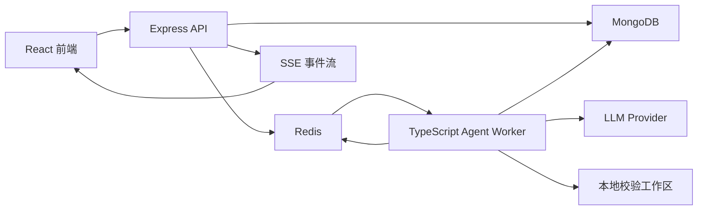
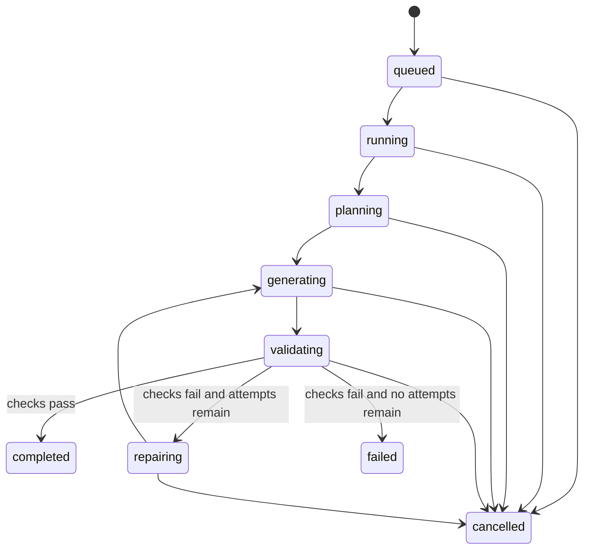

# TypeScript Agent 后端设计

## 技术决策

采用方案 2：保留当前 Express API 和 MongoDB 基础，新增一个由 Redis/BullMQ 驱动的 TypeScript Agent Worker。API 层负责认证、项目权限、Run 创建和 Server-Sent Events；Worker 负责长耗时的生成、校验、修复和快照持久化。

这个方案可以复用现有应用结构，同时把 AI 生成从同步 HTTP 请求里拆出去，避免一次生成阻塞接口线程。

## 当前上下文

项目目前已经具备：

- `apps/server`：Express、TypeScript、Mongoose/MongoDB、JWT 认证、OpenAI SDK。
- `apps/server/src/routes/chat.ts`：同步创建对话、发送消息并等待 AI 返回。
- `apps/server/src/services/aiService.ts`：直接调用 OpenAI，要求模型返回 markdown code block，再解析代码块。
- `apps/server/src/models/Chat.ts`：消息模型，支持可选的 `codeBlocks`。
- `apps/server/src/models/Project.ts`：项目元数据和框架设置。
- `docker-compose.yml`：MongoDB、server、web 三个服务。
- `apps/web`：React/TypeScript 前端，已经有项目、对话 API 和 v0 风格工作台 UI。

当前后端把代码生成当作一次阻塞式聊天回复处理。要做成 v0 类产品，需要把生成过程建模成持久化的 `AgentRun`，让前端能看到进度，并且让输出变成结构化文件快照，支持校验、修复和多轮迭代。

## 目标

- 后端和 Agent 系统全量使用 TypeScript。
- 每次生成都表示为一个持久化的 `AgentRun`。
- 通过 SSE 向前端实时推送进度。
- 生成结果存储为项目文件快照，而不是只存 markdown code block。
- 对生成的 React/Tailwind 代码执行 TypeScript 和 Vite build 校验。
- 支持基于最新成功快照的多轮编辑。
- 第一版范围收窄为 React + TypeScript + Tailwind，先把核心链路跑通。

## 非目标

- 第一版不支持 Vue 或 Svelte，即使 `Project.settings.framework` 里已有这些枚举值。
- 第一版不做生产级远程 Docker 沙箱集群。
- 第一版不做部署、GitHub PR 创建、计费、团队协作或模板市场。
- 不允许执行用户或模型提供的任意 shell 命令；校验命令由服务端固定。

## 架构



## 运行时组件

### Express API

职责：

- 使用现有 JWT middleware 完成用户认证。
- 使用 Zod 校验请求体。
- 创建 `AgentRun` 记录。
- 将 Agent 任务写入 BullMQ 队列。
- 从 MongoDB 读取 Run 状态和项目快照。
- 通过 SSE 推送 `AgentEvent`。
- 对 chat、project、run、snapshot 统一执行用户归属校验。

新增路由模块：

```text
apps/server/src/routes/agent.ts
```

### Agent Worker

职责：

- 从 BullMQ 消费排队中的 Run。
- 从对话历史、项目设置和最新成功快照中组装上下文。
- 按结构化输出协议调用模型。
- 将模型输出转换成文件操作。
- 把文件操作应用到内存文件树和临时校验工作区。
- 执行固定校验命令。
- 校验失败时执行有限次数的自动修复。
- 持久化成功快照和最终 Run 元数据。
- 在每个阶段写入并发布进度事件。

新增 Worker 入口：

```text
apps/server/src/worker.ts
```

Worker 和 API 共用领域模块，但以单独 Node 进程运行。

### Redis 和 BullMQ

Redis 用于：

- BullMQ 队列存储。
- Run 事件的实时 fanout。
- 短期取消标记。

MongoDB 仍然是持久化事实来源。Redis 数据即使丢失，也不影响已经完成的 Run 和快照。

### MongoDB

Mongo 存储：

- 现有 User、Chat、Project。
- AgentRun 和 AgentEvent。
- ProjectSnapshot 和文件树。
- 校验结果和生成产物元数据。

## 数据模型

### AgentRun

```ts
type AgentRunStatus =
  | 'queued'
  | 'running'
  | 'planning'
  | 'generating'
  | 'validating'
  | 'repairing'
  | 'completed'
  | 'failed'
  | 'cancelled';

interface AgentRun {
  _id: ObjectId;
  userId: ObjectId;
  projectId: ObjectId;
  chatId?: ObjectId;
  prompt: string;
  status: AgentRunStatus;
  mode: 'create' | 'edit';
  baseSnapshotId?: ObjectId;
  resultSnapshotId?: ObjectId;
  attempt: number;
  maxRepairAttempts: number;
  model: string;
  error?: {
    code: string;
    message: string;
    details?: unknown;
  };
  usage?: {
    inputTokens?: number;
    outputTokens?: number;
    totalTokens?: number;
  };
  createdAt: Date;
  updatedAt: Date;
  startedAt?: Date;
  completedAt?: Date;
}
```

索引：

- `{ userId: 1, updatedAt: -1 }`
- `{ projectId: 1, updatedAt: -1 }`
- `{ status: 1, updatedAt: 1 }`

### AgentEvent

```ts
type AgentEventType =
  | 'run.created'
  | 'run.started'
  | 'agent.step'
  | 'agent.plan'
  | 'file.changed'
  | 'validation.started'
  | 'validation.failed'
  | 'validation.passed'
  | 'repair.started'
  | 'run.completed'
  | 'run.failed'
  | 'run.cancelled';

interface AgentEvent {
  _id: ObjectId;
  runId: ObjectId;
  userId: ObjectId;
  projectId: ObjectId;
  type: AgentEventType;
  sequence: number;
  message: string;
  payload?: unknown;
  createdAt: Date;
}
```

SSE endpoint 按 `sequence` 顺序推送事件。如果浏览器断线重连，可以通过 `Last-Event-ID` 继续读取后续事件。

### ProjectSnapshot

```ts
interface ProjectFile {
  path: string;
  content: string;
  language: 'ts' | 'tsx' | 'css' | 'json' | 'html' | 'md';
  generatedByRunId?: ObjectId;
}

interface ProjectSnapshot {
  _id: ObjectId;
  userId: ObjectId;
  projectId: ObjectId;
  sourceRunId: ObjectId;
  parentSnapshotId?: ObjectId;
  files: ProjectFile[];
  packageJson: {
    dependencies: Record<string, string>;
    devDependencies: Record<string, string>;
    scripts: Record<string, string>;
  };
  validation: ValidationResult;
  summary: string;
  createdAt: Date;
}
```

第一版存储完整快照。等快照体积真的成为成本问题，再增加基于 diff 的存储。

### ValidationResult

```ts
interface ValidationResult {
  status: 'passed' | 'failed' | 'skipped';
  checks: Array<{
    name: 'type-check' | 'build';
    command: string;
    exitCode: number;
    stdout: string;
    stderr: string;
    durationMs: number;
  }>;
}
```

## API 设计

### 创建 Run

```http
POST /api/agent/runs
```

请求：

```ts
interface CreateAgentRunRequest {
  projectId: string;
  chatId?: string;
  prompt: string;
  mode?: 'create' | 'edit';
}
```

响应：

```ts
interface CreateAgentRunResponse {
  run: AgentRun;
}
```

行为：

- 校验用户是否拥有 `projectId` 和可选的 `chatId`。
- 选择最新成功的项目快照作为 `baseSnapshotId`。
- 创建状态为 `queued` 的 `AgentRun`。
- 将 Run 写入 BullMQ。
- 写入并发布 `run.created` 事件。

### 读取 Run

```http
GET /api/agent/runs/:runId
```

返回 Run、最近事件，以及可用时关联的结果快照。

### 推送 Run 事件

```http
GET /api/agent/runs/:runId/events
```

使用 SSE：

```text
id: 12
event: file.changed
data: {"path":"src/App.tsx","operation":"update"}
```

认证沿用现有 bearer token 方案。如果前端使用原生 `EventSource`，而它不能设置请求头，则前端应先向 API 申请一个短期 stream token，再用该 token 建立 SSE 连接。

### 取消 Run

```http
POST /api/agent/runs/:runId/cancel
```

在 Redis 中设置取消标记；如果 Run 尚未完成，则标记为 `cancelled`。Worker 在模型调用前、校验前、持久化前都要检查取消状态。

### 快照 API

```http
GET /api/projects/:projectId/snapshots
GET /api/projects/:projectId/snapshots/:snapshotId
```

快照按项目隔离，并且必须校验用户归属。接口可以放在现有 project route，也可以独立放到 `routes/snapshot.ts`。

## Agent 状态机



状态更新必须先写入 MongoDB，再发布事件。事件流只是持久化状态的实时视图，不是唯一记录。

## Agent 流程

### 1. 归一化请求

Worker 加载 `AgentRun`、Project、Chat 和最新快照。对于非法组合要直接拒绝，例如 edit 模式没有 base snapshot。

### 2. 组装上下文

上下文包括：

- 用户 prompt。
- 项目设置。
- 最近对话消息。
- base snapshot 的文件清单。
- base snapshot 中选中的文件内容。
- 如果当前是修复尝试，则包括上一轮校验错误。

第一版上下文选择保持简单：小项目直接包含全部文件；当项目超过配置的字符上限后，只包含文件清单和最近变更文件。

### 3. 规划

Planner 要求模型返回结构化计划：

```ts
interface AgentPlan {
  summary: string;
  steps: Array<{
    title: string;
    intent: string;
    filesLikelyTouched: string[];
  }>;
  assumptions: string[];
}
```

计划通过 `agent.plan` 展示给前端。它不是最终事实，只是后续生成步骤的指导。

### 4. 生成文件变更

Generator 返回结构化文件操作：

```ts
type FileOperation =
  | { type: 'create'; path: string; content: string }
  | { type: 'update'; path: string; content: string }
  | { type: 'delete'; path: string };

interface GenerationResult {
  message: string;
  operations: FileOperation[];
  dependencies: Record<string, string>;
  devDependencies: Record<string, string>;
}
```

所有模型输出都必须经过 Zod 校验。非法输出视为可恢复 Agent 错误，并允许重试一次。

### 5. 应用变更

Patch applier 校验：

- 路径必须是相对路径。
- 路径不能逃逸项目目录。
- 不允许生成二进制文件。
- 文件扩展名必须在允许列表里。
- 删除操作不能删除必需基础文件，例如 `package.json`、`index.html`、`src/main.tsx`。

每个成功应用的变更都发布 `file.changed` 事件。

### 6. 校验

Validator 把候选快照写入本地临时工作区，然后执行固定命令：

```text
npm run type-check
npm run build
```

项目模板决定这些 scripts 的内容。Worker 不执行模型选择的命令。

持久化前要裁剪校验输出，避免日志过大。开发环境可以在临时文件中保留完整日志，但 API 不应无筛选地暴露完整日志。

### 7. 修复

如果校验失败，Repairer 接收：

- 当前文件树。
- 失败的 check 名称。
- 相关诊断信息。
- 原始 prompt。
- 上一轮计划。

第一版最多允许两次修复尝试。如果最后仍失败，则 Run 标记为 `failed`，候选快照不提升为项目最新快照。

### 8. 持久化快照

成功时：

- 保存 `ProjectSnapshot`。
- 设置 `AgentRun.resultSnapshotId`。
- 向 `Chat` 追加一条 assistant 消息，内容包含 run summary 和 snapshot reference。
- 将 Run 标记为 `completed`。
- 发布 `run.completed`。

## TypeScript 模块布局

```text
apps/server/src/
  agent/
    orchestrator.ts
    contextBuilder.ts
    planner.ts
    generator.ts
    patchApplier.ts
    validator.ts
    repairer.ts
    eventBus.ts
    queue.ts
    schemas.ts
    types.ts
    workspace/
      createWorkspace.ts
      runCommand.ts
  models/
    AgentRun.ts
    AgentEvent.ts
    ProjectSnapshot.ts
  routes/
    agent.ts
  worker.ts
```

每个 Agent 模块只承担一个清晰职责：

- `contextBuilder`：只负责数据库读取和上下文组装。
- `planner`、`generator`、`repairer`：只负责模型调用。
- `patchApplier`：只负责确定性的文件树变换。
- `validator`：只负责临时工作区和固定命令执行。
- `eventBus`：只负责持久化事件并发布到 Redis。
- `orchestrator`：负责协调状态机。

## LLM Provider 契约

把 OpenAI SDK 包在本地接口后面：

```ts
interface ModelClient {
  generatePlan(input: PlanInput): Promise<AgentPlan>;
  generateFiles(input: GenerateInput): Promise<GenerationResult>;
  repairFiles(input: RepairInput): Promise<GenerationResult>;
  generateChatTitle(input: string): Promise<string>;
}
```

这样 route handler 和 Agent 编排逻辑不会直接依赖某一家模型 provider。未来要接 Claude、Kimi 或其他模型时，是替换 provider，而不是重写 Agent。

## 前端集成

前端流程：

1. 用户在 v0 workspace 提交 prompt。
2. Web 调用 `POST /api/agent/runs`。
3. Web 打开 `GET /api/agent/runs/:runId/events`。
4. Web 根据 `agent.step` 和 `validation.*` 更新 timeline。
5. Web 在收到 `file.changed` 或 `run.completed` 时更新文件树和预览。
6. Web 在完成后拉取结果快照。

现有 `chatApi.create` 和 `chatApi.sendMessage` 可以保留给 legacy chat 页面。v0 workspace 应迁移到 `agentApi`，这样才能展示真实进度。

## 错误处理

Run 失败要使用类型化错误：

```ts
type AgentErrorCode =
  | 'PROJECT_NOT_FOUND'
  | 'INVALID_MODEL_OUTPUT'
  | 'MODEL_REQUEST_FAILED'
  | 'VALIDATION_FAILED'
  | 'WORKSPACE_ERROR'
  | 'RUN_CANCELLED'
  | 'RATE_LIMITED';
```

面向用户的错误消息要简洁，不暴露 secret、完整 prompt、原始认证头或内部堆栈。

重试策略：

- Queue 执行重试：针对短暂 worker crash，重试一次。
- 模型调用重试：针对传输错误或非法结构化输出，重试一次。
- 修复重试：最多两次 validation repair。
- 用户显式取消后不再重试。

## 安全与隔离

- 所有 Run、Event、Snapshot 查询都必须带 `userId` 条件。
- 文件路径必须 normalize；绝对路径和父级目录穿越必须拒绝。
- Validator 只执行固定项目命令。
- 暴露给校验流程的环境变量保持最小化。
- 临时工作区放在 repo 外，例如 `/tmp/v0-agent-runs/<runId>`。
- 成功校验后删除临时工作区；失败 Run 在日志捕获完成后也删除临时工作区。
- 普通 API 限流和 Agent Run 创建限流要区分；Run 创建应更严格。

## 配置

新增环境变量：

```text
REDIS_URL=redis://localhost:6379
AGENT_QUEUE_NAME=v0-agent-runs
AGENT_MODEL=gpt-4.1
AGENT_MAX_REPAIR_ATTEMPTS=2
AGENT_WORKSPACE_ROOT=/tmp/v0-agent-runs
AGENT_CONTEXT_CHAR_LIMIT=120000
```

具体模型通过配置控制，代码里不要硬编码 preview model。

## Docker Compose 变更

新增：

- `redis`：Redis 7 服务。
- `worker`：使用同一个 server image 或 build target，启动命令为 `npm run worker --workspace @v0/server`。

`server` 和 `worker` 都需要 `MONGODB_URI`、`REDIS_URL` 和模型 provider key。只有 `server` 对外暴露 `3001` 端口。

## 测试策略

单元测试：

- Zod schemas 能拒绝非法模型输出。
- `patchApplier` 能阻止路径穿越和非法操作。
- 状态转换 helper 能拒绝非法状态转换。
- dependency merge 逻辑是确定性的。

集成测试：

- create run endpoint 能入队 job 并持久化 `AgentRun`。
- SSE endpoint 能按顺序推送已存储事件。
- 使用 fake `ModelClient` 时，worker 能完成一个 Run。
- validation 失败后能触发 repair，并在 fake repair 修复问题后完成 Run。

手动验证：

- 启动 MongoDB、Redis、API、worker 和 web。
- 从 v0 workspace 提交一个 prompt。
- 确认 timeline 事件实时推送。
- 确认成功快照被保存。
- 刷新页面后能从快照恢复已完成项目。

## 实施阶段

### Phase 1：领域模型和队列基础

- 新增 BullMQ 和 Redis 配置。
- 新增 Agent models。
- 新增 `agentApi` 路由：创建、读取、取消 Run，以及读取事件。
- 新增事件持久化和 SSE streaming。
- 新增 worker 入口，先支持把 fake run 标记为 completed。

### Phase 2：文件快照链路

- 新增 `ProjectSnapshot` model。
- 新增文件树 schema 和 snapshot APIs。
- 将生成产物从 markdown code block 迁移到结构化 file operations。
- 将 v0 workspace 接到 snapshots。

### Phase 3：Agent 生成

- 新增 planner、generator、结构化输出校验和 patch application。
- 将模型调用保持在 `ModelClient` 后面。
- 只生成 React + TypeScript + Tailwind 文件。

### Phase 4：校验和修复

- 新增临时工作区创建。
- 执行固定 `type-check` 和 `build` 命令。
- 把诊断信息输入 repairer。
- 修复次数最多两次。

### Phase 5：产品体验打磨

- 增加取消 Run 的前端交互。
- 增加更完整的 Run 历史。
- 增加 snapshot rollback。
- 增加 dependencies 展示。
- 在 UI 中展示简洁的校验错误。

## 验收标准

- 后端代码端到端使用 TypeScript。
- `POST /api/agent/runs` 能快速返回 queued Run。
- 单独 Worker 能处理 Run。
- 前端能通过 SSE 接收 Run 事件。
- 成功 Run 会创建 `ProjectSnapshot`。
- 校验失败时不会把坏快照提升为项目最新快照。
- 测试里至少有一个 repair attempt 能修复生成的 TypeScript/build 错误。
- 所有新 endpoint 都沿用现有 auth 和项目归属校验。
