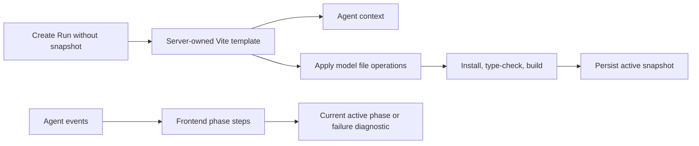

# Create Template and Progress Design

## Goal

Make real Create-mode Agent runs start from a deterministic, buildable React
Vite project and make the frontend display the actual Agent phase instead of
remaining on the initial Worker waiting message.

This change addresses the first real DeepSeek run, which successfully planned,
generated, and repaired files but exhausted its repair attempts because the
project never contained `index.html`.

## Scope

The backend change covers Create runs without a base snapshot. Edit runs retain
their active snapshot as the complete project baseline.

The frontend change covers queued, planning, generating, validating, repairing,
persisting, completed, failed, and cancelled Run presentation.

This change does not add user-selectable models, change validation commands,
increase repair attempts, or make generated backend services executable.

## Backend Architecture

### Deterministic project template

Add a focused `projectTemplate.ts` module that exports a factory for the
server-owned React Vite baseline. It returns fresh `ProjectFile` objects for:

- `index.html`;
- `src/main.tsx`;
- `src/App.tsx`;
- `src/index.css`.

The template must be a complete browser entry point before any model output is
applied. Its placeholder `App.tsx` is intentionally small and safe for the
model to replace.

`package.json` remains server-owned through the existing
`mergeProjectPackageJson` and `writeServerPackageJson` logic. The template
factory does not duplicate dependency or script ownership.

### Orchestrator integration

When `processAgentRun` cannot load a base snapshot, pass the deterministic
template to `runAgentGenerationWithValidation` as `baseFiles`.

When a base snapshot exists, pass its stored files unchanged. Edit mode must
never silently reset user-generated content to the template.

Model operations continue through `applyFileOperations`:

- create/update operations replace matching template files;
- new business files are added;
- deletion of `package.json`, `index.html`, and `src/main.tsx` remains rejected.

The model sees the baseline in its Agent context for Create mode so its plan and
generation are based on the same project later validated. The context builder
must therefore receive the template when no snapshot exists, rather than
injecting it only after the model call.

## Frontend Architecture

### Phase labels

Extend event-to-step mapping with explicit labels:

- `run.created` → Run queued;
- `run.started` → Worker started;
- planning `agent.step` → Planning project changes;
- generating `agent.step` → Generating application files;
- `validation.started` → Validating generated project;
- `validation.failed` → Validation failed;
- `repair.started` → Repairing generated project;
- `run.completed` → Snapshot ready;
- `run.failed` → Generation failed;
- `run.cancelled` → Generation cancelled.

The event payload phase is authoritative for `agent.step`; event text remains
the fallback for unknown future phases.

### Active-step progression

`startApiGeneration` begins with one active queued step. Each newly accepted
Agent event:

1. marks every previously active non-terminal step as done;
2. appends the new event step;
3. marks the new step active;
4. updates the overall generation status for terminal events.

This prevents the initial Worker waiting message from remaining visually active
while the Run is already validating or repairing.

Repeated events remain deduplicated by sequence and type.

### Failure diagnostics

Live `run.failed` events show the concise event message immediately. The
subsequent Run-detail response remains authoritative and replaces that message
with the first useful validation stderr/stdout line when structured
`VALIDATION_FAILED` details exist.

The user can still inspect Code and Run history after failure.

## Data Flow

## Error Handling

- Unsafe model file paths continue to fail before validation.
- Required entry files cannot be deleted by model operations or repairs.
- A model may replace template entry files, but the normal validator determines
  whether the replacement is valid.
- Validation failures retain structured command diagnostics.
- Unknown event types remain visible using their server message.
- A duplicate or stale event does not regress the active UI step.

## Testing

Follow test-driven development:

1. Template unit tests assert exact required paths, fresh object creation, valid
   languages, and browser entry wiring.
2. Orchestrator tests prove that a Create run whose model only updates
   `src/App.tsx` retains `index.html`, `src/main.tsx`, and `src/index.css`.
3. Process-level tests prove Edit runs keep snapshot files rather than applying
   the default template.
4. Frontend state tests prove queued, planning, generating, validating,
   repairing, completed, failed, and cancelled progress transitions.
5. Frontend tests prove each new event completes the previous active step and
   duplicate events do not alter state.
6. Existing Server/Web tests, type-check, builds, integration tests, and
   browser smoke remain green.
7. A real DeepSeek browser Run confirms the generated project reaches a
   terminal state and no longer remains visually on Worker waiting.

## Acceptance Criteria

- A new Create Run always begins with a complete React Vite entry structure.
- Model output that omits `index.html` can still pass Vite entry resolution.
- Edit Runs retain their existing snapshot baseline.
- The active frontend step reflects validation and repair phases.
- The initial Worker waiting step becomes done after the next event.
- Terminal failure displays a concise validation diagnostic after Run detail is
  loaded.
- Fake smoke remains deterministic.
- A real DeepSeek Run can complete without spending repair attempts on missing
  server-owned entry scaffolding.
