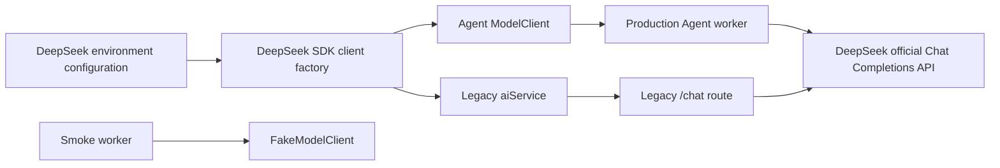

# DeepSeek Model Provider Design

## Goal

Switch both production model-call paths from OpenAI to the official DeepSeek
API while preserving the existing Agent orchestration, structured-output
contracts, and smoke-test topology.

The default production model is `deepseek-v4-flash`. Operators can select
`deepseek-v4-pro` without changing code.

This change covers:

- the Agent worker's plan, file-generation, and repair calls;
- the legacy `/chat` route's code-generation and title-generation calls;
- shared environment configuration and operating documentation.

It does not add runtime provider selection in the UI, model fallback, streaming,
or real API calls to the automated test suite.

## Provider Strategy

DeepSeek's official API exposes an OpenAI-compatible Chat Completions endpoint.
Keep the installed `openai` SDK as the transport and configure it with:

- `baseURL: https://api.deepseek.com`;
- `apiKey: DEEPSEEK_API_KEY`;
- a DeepSeek model name.

Do not introduce a general multi-provider factory until a second production
provider is required. The existing `ModelClient` interface remains the Agent
boundary, so orchestration and fake test collaborators do not become
provider-aware.

## Configuration

Add one focused configuration module for the production model service:

- `DEEPSEEK_API_KEY` is required when a production model client is created;
- `DEEPSEEK_BASE_URL` defaults to `https://api.deepseek.com`;
- `DEEPSEEK_MODEL` defaults to `deepseek-v4-flash`;
- `AGENT_MODEL`, when set, overrides `DEEPSEEK_MODEL` for Agent worker calls.

The shared default serves legacy chat code generation and title generation.
The Agent-specific override preserves the existing ability to test a different
generation model without changing unrelated chat behavior.

Secrets remain environment-only. Example environment files and documentation
contain variable names and safe defaults, never an API key.

## Components

### DeepSeek-compatible client factory

Create a small factory that validates configuration and constructs the OpenAI
SDK client with DeepSeek's official Base URL. Configuration errors use stable,
sanitized application error messages and never include credentials.

The factory owns transport construction only. It does not know about prompts,
schemas, Agent runs, or chat persistence.

### Agent model client

Retain `createOpenAIModelClient` as the transport-agnostic, testable adapter
around an OpenAI-compatible `createCompletion` function. Rename it only if the
result improves clarity without forcing unrelated changes.

The production creator uses the shared DeepSeek-compatible factory and the
Agent model selection. Existing requests continue to send:

- system and user messages;
- `response_format: { "type": "json_object" }`;
- a low generation temperature;
- the selected model name.

The existing system instructions already request JSON and include the expected
object shape, satisfying DeepSeek JSON Output requirements. Empty or invalid
responses retain the existing single retry and schema validation behavior.

### Legacy AI service

Remove the module-load-time OpenAI client configured with `OPENAI_API_KEY`.
Create or obtain the DeepSeek-compatible client through the shared factory so
both `generateCode` and `generateChatTitle` use the same provider settings.

Replace the hard-coded OpenAI model names with the configured DeepSeek model.
The existing response parsing and fallback title behavior remain unchanged.

### Worker bootstrap

The production worker reads the unified provider configuration and constructs
the Agent model client with the Agent-specific model selection. The smoke worker
continues using `FakeModelClient`, so deterministic end-to-end tests remain
free, offline, and repeatable.

## Data Flow



No provider configuration is exposed to the browser. The server remains the
only caller of the DeepSeek API.

## Error Handling

- Missing `DEEPSEEK_API_KEY` fails production-client creation with a clear
  configuration error.
- Provider request failures map to sanitized application errors without logging
  keys, authorization headers, or raw provider payloads.
- Agent structured-output failures retain the current schema validation and
  retry behavior.
- The legacy title call retains its `New Chat` fallback.
- Code-generation failures remain visible to the route through the existing
  error path.

## Testing

Follow test-driven development:

1. Configuration tests cover defaults, environment overrides, and the
   `AGENT_MODEL` precedence rule.
2. Factory tests verify API key and Base URL propagation using injected or
   mocked construction boundaries without making network calls.
3. Agent model-client tests continue covering JSON parsing, usage normalization,
   retry, repair diagnostics, and sanitized provider failures.
4. Legacy AI-service tests verify that both generation functions use the
   configured DeepSeek model.
5. Server unit tests, integration tests, type-check, and build remain green.
6. Existing smoke tests continue using fake model and validator collaborators.
7. A documented optional manual check starts the production worker with a real
   key and submits one browser generation task. This check is not run
   automatically because it incurs external cost and requires network access.

## Documentation and Operations

Update the example environment and local-run documentation with:

```dotenv
DEEPSEEK_API_KEY=
DEEPSEEK_BASE_URL=https://api.deepseek.com
DEEPSEEK_MODEL=deepseek-v4-flash
# Optional Agent-only override:
AGENT_MODEL=
```

Document that:

- `start:worker` performs real DeepSeek calls and real validation;
- `start:smoke-worker` uses deterministic fake collaborators;
- switching to `deepseek-v4-pro` requires only an environment change;
- API keys must not be committed.

## Acceptance Criteria

- A production Agent run uses the official DeepSeek API.
- The legacy `/chat` path no longer depends on `OPENAI_API_KEY` or OpenAI model
  names.
- `deepseek-v4-flash` is the default model.
- `DEEPSEEK_BASE_URL`, `DEEPSEEK_MODEL`, and `AGENT_MODEL` overrides work as
  documented.
- Missing credentials fail clearly without leaking sensitive values.
- Automated tests make no real DeepSeek requests.
- The fake smoke topology remains deterministic.
- Server tests, type-check, and build pass.
