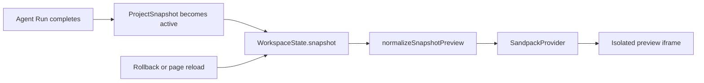

# Generated Snapshot Preview Design

## Goal

Replace the static mock inside the v0 workspace Preview panel with an isolated,
executable preview of the active generated `ProjectSnapshot`.

The first version supports the existing Agent contract only:

- React 18;
- TypeScript and TSX;
- CSS;
- browser-side dependencies declared by the snapshot;
- static client-side applications.

It does not support Vue, Svelte, generated backend services, shell commands,
deployment, or permanent preview URLs.

## Architecture

Use the existing `@codesandbox/sandpack-react` dependency to compile and execute
snapshot files inside Sandpack's isolated iframe. Generated code must never run
inside the host application's React tree and must not receive the host
application's authentication token, Axios client, local state, or DOM access.

The workspace remains the source of snapshot selection. Whenever the active
snapshot changes because a Run completes, a rollback succeeds, or persisted
state is restored after a page reload, the Preview panel receives that snapshot
and rebuilds the sandbox.

No new backend endpoint, stored build artifact, or preview server is introduced.

## Components

### Snapshot preview model

Create a focused module that converts `WorkspaceSnapshot` into Sandpack input:

- normalize every snapshot path to a leading `/`;
- preserve source contents without evaluation in the host;
- expose production dependencies from `packageJson.dependencies`;
- ensure React and React DOM are available when older snapshots omit them;
- select `/src/main.tsx` as the active entry when present;
- reject absolute paths, parent traversal, empty paths, and unsupported file
  languages before passing files to Sandpack.

Development-only build dependencies are not installed in the browser sandbox.
Sandpack supplies its own bundler, so Vite, TypeScript, PostCSS, and Tailwind CLI
packages are unnecessary at runtime.

### SnapshotPreview

Create a component responsible only for the executable preview:

- instantiate `SandpackProvider` with the React TypeScript template;
- pass normalized files and runtime dependencies;
- render `SandpackPreview` without exposing the Sandpack editor;
- display a loading state while the bundler starts;
- display compile and runtime diagnostics inside the preview surface;
- expose a `Reload preview` control;
- key the provider by snapshot ID so snapshot changes create a clean runtime.

The iframe is the execution boundary. The generated application receives no host
API credentials or privileged bridge.

### PreviewPanel integration

Change the workspace Preview panel to accept the active `WorkspaceSnapshot`
instead of a selected marketing template.

Its visible states are:

1. No snapshot: explain that Preview becomes available after a successful Run.
2. Run in progress with an existing snapshot: continue showing the last active
   snapshot and indicate that a new version is being generated.
3. Passed or skipped active snapshot: execute it in Sandpack.
4. Invalid snapshot conversion: show a concise preview-specific error while
   leaving Code, history, and rollback controls usable.

The existing fake dashboard, fake URL, template illustration, and mocked Design
Mode overlay are removed from Preview. Design and Deploy remain separate panels
and are outside this change.

## Data Flow

The preview does not fetch snapshots independently. This avoids duplicate
ownership logic and keeps the existing workspace restore flow authoritative.

## Error Handling

- Unsafe or unsupported snapshot paths fail conversion before iframe execution.
- A missing entry file produces an explicit `Preview entry file is missing`
  message.
- Sandpack bundler and runtime errors are visible in its error overlay.
- A preview error does not change Run status, snapshot validation status, or
  active snapshot selection.
- Reloading the preview resets only the iframe runtime.

## Testing

Follow test-driven development:

1. Pure unit tests cover path normalization, unsafe paths, dependency selection,
   entry-file requirements, and deterministic Sandpack file conversion.
2. Component-facing state tests cover empty, running-with-previous-snapshot, and
   executable snapshot states without depending on Sandpack internals.
3. Existing Web unit tests, type-check, and production build remain green.
4. Extend the Playwright smoke test to enter the preview iframe and assert the
   deterministic generated application is visible.
5. Reload the host page and assert the restored active snapshot executes again.

## Acceptance Criteria

- The Preview panel displays the generated `src/App.tsx` application rather than
  the static mock.
- Generated code executes only inside an iframe sandbox.
- Runtime dependencies come from the active snapshot.
- Run completion, rollback, snapshot switching, and page reload update Preview.
- Compile/runtime failures are visible without breaking the host workspace.
- The deterministic Compose browser smoke verifies rendered content inside the
  iframe.
- Server APIs and persisted snapshot schemas remain unchanged.
