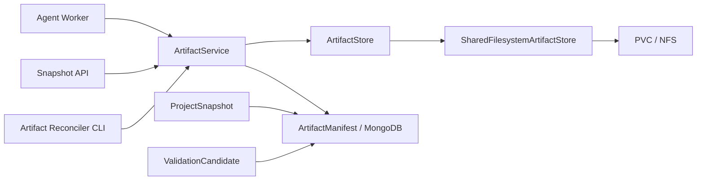

# ArtifactStore 与 Snapshot Artifact 设计

**状态：** 已确认
**日期：** 2026-07-26
**上层设计：** `2026-07-26-daytona-sandbox-provider-design.md`

## 1. 背景

Workspace、ProjectBranch、BranchExecutionLease 和 Branch Head CAS 已经落地。
下一步需要把源码、依赖声明和验证候选从 MongoDB 大文档转移到永久
ArtifactStore，为后续 SandboxProvider 从逻辑 Snapshot 恢复工作区提供唯一、
可校验的数据来源。

这是新项目，不需要处理生产存量数据。本设计直接采用最终数据模型：
ProjectSnapshot 和 ValidationCandidate 不再保存 `files` 与 `packageJson`，
也不提供旧格式读取回退、双写或迁移 CLI。

## 2. 目标

- 定义不依赖文件系统、Daytona、Express 或 BullMQ 的 ArtifactStore 协议。
- 提供所有 API/Worker 节点共享的 PVC/NFS 文件系统实现。
- 将源码文件树和 packageJson 保存为不可变、可校验的 gzip JSON Blob。
- 在 MongoDB 保存 ArtifactManifest，并通过 artifactId 关联 Snapshot 和 Candidate。
- 保持 Snapshot 详情 API 的外部响应兼容。
- 保证 Worker 重试不会重复创建 Artifact。
- 检测丢失、损坏、超限和不支持格式的 Artifact。
- 为后续 SandboxService 提供稳定的 Bundle 读取接口。

## 3. 非目标

- S3、OSS 或其他对象存储实现。
- Daytona、SandboxProvider、SandboxLease 或 PreviewDeployment。
- 增量 Snapshot、文件级内容寻址或跨 Artifact 去重。
- 对已有 Snapshot/Candidate 文档进行数据迁移。
- 长期双写 MongoDB 大字段。
- 常驻 Reconciler 调度器。
- 自动备份共享存储。

## 4. 已确认决策

1. ArtifactStore 使用所有 API 和 Worker 节点共同挂载的 PVC/NFS 目录。
2. Artifact 格式为不可变 `gzip JSON Blob`。
3. MongoDB 仅保存 Manifest、Snapshot/Candidate 元数据和 artifactId。
4. ProjectSnapshot 和 ValidationCandidate 直接删除 `files`、`packageJson`。
5. 不实现旧格式读取回退或数据迁移。
6. Artifact 写入使用持久状态机和 idempotencyKey。
7. Artifact 读取必须验证状态、大小、格式和 SHA-256。
8. validation、summary 等高频列表字段继续保存在 MongoDB。
9. ArtifactStore 不暴露绝对路径或文件系统句柄。
10. 本阶段提供一次性 Reconciler 函数和 CLI，不引入定时调度。

## 5. 总体架构



### 5.1 ArtifactStore

ArtifactStore 是字节存储协议，只理解 storageKey 和 bytes。它不理解 Workspace、
Project、Branch、Run、Snapshot 或 Candidate。

```ts
interface ArtifactStore {
  put(input: {
    storageKey: string
    bytes: Uint8Array
  }): Promise<void>

  get(storageKey: string): Promise<Uint8Array>
  exists(storageKey: string): Promise<boolean>
  delete(storageKey: string): Promise<void>
}
```

### 5.2 SharedFilesystemArtifactStore

SharedFilesystemArtifactStore 将 Blob 保存到配置的共享根目录。它负责：

- storageKey 根目录包含检查。
- 临时文件写入、fsync 和原子 rename。
- 拒绝覆盖已存在的最终文件。
- 拒绝符号链接和非普通文件。
- 将文件系统错误映射为稳定的 Artifact 错误。

它不负责 gzip、JSON、哈希、Manifest 或领域校验。

### 5.3 ArtifactService

ArtifactService 是领域内容与字节存储之间的唯一入口，负责：

- Bundle 规范化和结构校验。
- 稳定 JSON 序列化。
- 未压缩内容 SHA-256。
- gzip 压缩与解压。
- 大小限制。
- Manifest 状态转换。
- idempotencyKey 恢复。
- Bundle 完整性校验。
- Artifact 错误分类。

Snapshot API、Agent Worker、验证重试以及后续 SandboxService 只能通过
ArtifactService 读取源码 Bundle。

## 6. Artifact 数据模型

### 6.1 ArtifactManifest

```ts
type ArtifactKind =
  | 'project_snapshot'
  | 'validation_candidate'

type ArtifactManifestState =
  | 'writing'
  | 'ready'
  | 'corrupt'
  | 'delete_pending'

interface ArtifactManifest {
  artifactId: string
  workspaceId: ObjectId
  projectId: ObjectId
  createdByRunId: ObjectId
  kind: ArtifactKind
  idempotencyKey: string

  format: 'open-v0.bundle+json+gzip'
  formatVersion: 1
  storageKey: string
  sha256: string
  uncompressedBytes: number
  compressedBytes: number
  fileCount: number

  state: ArtifactManifestState
  errorCode?: string
  createdAt: Date
  updatedAt: Date
}
```

索引：

- `artifactId` 唯一索引。
- `idempotencyKey` 唯一索引。
- `{ workspaceId, projectId, createdAt: -1 }`。
- `{ state, updatedAt }`，用于 Reconciler。
- `{ createdByRunId, kind }`。

`storageKey` 由服务端生成：

```text
v1/<artifactId[0..2]>/<artifactId[2..4]>/<artifactId>.json.gz
```

调用方不能指定 storageKey。

### 6.2 ProjectArtifactBundleV1

```ts
interface ProjectArtifactBundleV1 {
  version: 1
  files: Array<{
    path: string
    content: string
    language: 'ts' | 'tsx' | 'css' | 'json' | 'html' | 'md'
    generatedByRunId?: string
  }>
  packageJson: {
    dependencies: Record<string, string>
    devDependencies: Record<string, string>
    scripts: Record<string, string>
  }
}
```

规范化规则：

- 文件按 path 升序排序。
- dependencies、devDependencies 和 scripts 按 key 排序。
- 路径必须是安全的项目相对路径。
- 禁止绝对路径、盘符路径、`..`、NUL、重复路径和不支持的扩展名。
- generatedByRunId 序列化为字符串。
- JSON 使用稳定字段顺序和 UTF-8 编码。
- SHA-256 基于未压缩的规范化 JSON bytes。

### 6.3 ProjectSnapshot

ProjectSnapshot 调整为：

```ts
interface ProjectSnapshot {
  workspaceId: ObjectId
  branchId: ObjectId
  userId: ObjectId
  projectId: ObjectId
  sourceRunId: ObjectId
  parentSnapshotId?: ObjectId
  artifactId: string
  validation: ValidationResult
  summary: string
  createdAt: Date
  updatedAt: Date
}
```

删除 `files` 和 `packageJson`。

### 6.4 ValidationCandidate

ValidationCandidate 调整为：

```ts
interface ValidationCandidate {
  workspaceId: ObjectId
  branchId: ObjectId
  userId: ObjectId
  projectId: ObjectId
  sourceRunId: ObjectId
  artifactId: string
  summary: string
  expiresAt: Date
  createdAt: Date
  updatedAt: Date
}
```

删除 `files` 和 `packageJson`。

## 7. 配置与部署约束

```env
ARTIFACT_STORE_DRIVER=shared-filesystem
ARTIFACT_STORE_ROOT=/var/lib/open-v0/artifacts
ARTIFACT_MAX_BUNDLE_BYTES=52428800
ARTIFACT_MAX_COMPRESSED_BYTES=20971520
ARTIFACT_WRITING_TIMEOUT_MS=300000
ARTIFACT_ORPHAN_RETENTION_MS=86400000
```

部署要求：

- 所有 API 和 Worker 节点挂载相同的持久目录。
- 临时文件和最终文件必须位于同一挂载点。
- Artifact 根目录不能位于仓库、容器临时层或公开静态目录。
- 运行账户仅拥有 Artifact 根目录所需权限。
- Artifact 根目录不能由 HTTP Server 直接暴露。
- 部署系统负责 PVC/NFS 的备份、容量告警和灾难恢复。

本地开发默认使用仓库外目录，测试使用每个测试独立的临时目录。

## 8. 写入状态机

```text
创建 writing Manifest
        ↓
规范化并校验 Bundle
        ↓
写入临时 Blob
        ↓
fsync + 原子 rename
        ↓
读取并校验 SHA-256
        ↓
Manifest → ready
        ↓
创建 Snapshot / Candidate 引用
```

idempotencyKey：

- Snapshot：`snapshot:<runId>`
- Validation Candidate：`candidate:<runId>`

重试规则：

- 不存在 Manifest：创建 `writing` 并执行完整写入。
- 存在 `ready`：读取并校验后直接复用 artifactId。
- 存在 `writing` 且最终 Blob 有效：完成校验并推进 `ready`。
- 存在 `writing` 且 Blob 不存在：使用相同 artifactId 重新写入。
- 存在 `corrupt`：拒绝复用，返回稳定错误。
- 存在 `delete_pending`：拒绝复用，避免与删除流程竞争。

Manifest ready 后 Snapshot/Candidate 创建失败时不删除 Artifact。Worker 重试使用同一
idempotencyKey，并完成领域引用创建。

## 9. 读取流程

1. 根据 artifactId 查询 Manifest。
2. 要求 Manifest 状态为 `ready`。
3. 从 ArtifactStore 读取压缩 bytes。
4. 在解压前检查 compressedBytes 上限。
5. 使用有界解压检查 uncompressedBytes 上限，防止压缩炸弹。
6. 重新计算未压缩 bytes 的 SHA-256。
7. 校验格式、版本和 Bundle schema。
8. 返回规范化 ProjectArtifactBundleV1。

Snapshot API：

- Snapshot 列表不读取 Blob，fileCount 来自 Manifest。
- Snapshot 详情读取 Bundle，并在响应中补充 files 和 packageJson。
- API 不返回 storageKey、绝对路径或 Manifest 内部错误。

Agent Worker：

- Edit/Create 上下文基线从 baseSnapshot.artifactId 加载。
- Snapshot 创建先写 Artifact，再创建 ProjectSnapshot，再执行 Branch CAS。
- Branch CAS 冲突不会删除 Artifact 或 Snapshot。
- Validation Candidate 失败时先写 candidate Artifact，再保存 Candidate 元数据。
- Validation retry 从 Candidate artifactId 加载 Bundle。

## 10. 错误模型

| 错误码 | 场景 | 重试性 |
|---|---|---|
| `ARTIFACT_STORE_UNAVAILABLE` | PVC/NFS 暂时不可访问 | 可重试 |
| `ARTIFACT_WRITE_FAILED` | 临时文件、fsync 或 rename 失败 | 视底层错误 |
| `ARTIFACT_NOT_FOUND` | Manifest 或 Blob 不存在 | 不可自动忽略 |
| `ARTIFACT_CORRUPT` | 哈希、长度或格式校验失败 | 不可重试同一 Artifact |
| `ARTIFACT_FORMAT_UNSUPPORTED` | formatVersion 未支持 | 不可重试 |
| `ARTIFACT_LIMIT_EXCEEDED` | 文件数或字节数超限 | 不可重试 |
| `ARTIFACT_INVALID_PATH` | Bundle 含不安全路径 | 不可重试 |
| `ARTIFACT_IDEMPOTENCY_CONFLICT` | 同 key 对应不同规范化内容 | 不可重试 |

基础设施错误进入现有可重试分类；内容、格式和安全错误作为稳定的 AgentRun 失败原因。

## 11. ArtifactReconciler

本阶段提供可单次调用的 Reconciler 函数和 CLI：

```text
npm run reconcile:artifacts --workspace @v0/server
```

规则：

- 超时 `writing` 且最终 Blob 完整：校验并推进 `ready`。
- 超时 `writing` 且 Blob 缺失：标记 `corrupt`。
- `ready` 但 Blob 缺失或校验失败：标记 `corrupt`。
- 无 Snapshot/Candidate 引用且超过保留期：标记 `delete_pending`。
- `delete_pending`：删除 Blob 后删除 Manifest。
- 删除失败保留 `delete_pending`，下次重试。

本阶段不提供定时调度；生产调度在 Sandbox Core 或运维任务中接入。

## 12. 安全边界

- storageKey 只能由 ArtifactService 生成。
- 文件系统实现解析路径后必须验证仍位于配置根目录。
- 拒绝路径中的符号链接和非普通最终文件。
- 最终 Blob 使用排他创建语义，不能覆盖。
- 临时文件使用随机后缀，成功后原子 rename。
- 日志不记录源码、packageJson、压缩 bytes 或绝对根路径。
- HTTP 响应不暴露 storageKey、共享目录或内部文件系统错误。
- Bundle 解析前后都执行大小限制。
- Bundle 文件路径复用现有 Project 文件安全规则。

## 13. 测试策略

### 13.1 Bundle 单元测试

- 规范化排序稳定。
- 相同内容得到相同 SHA-256。
- 文件或依赖顺序变化不影响规范化结果。
- 非法路径、重复文件和超限内容被拒绝。
- gzip 往返保持 Bundle 一致。
- 超出压缩或解压上限时拒绝读取。

### 13.2 ArtifactStore Contract Test

- put/get/exists/delete。
- 不覆盖最终 Blob。
- 临时文件不可见。
- 路径穿越被拒绝。
- 符号链接被拒绝。
- 并发写同一 key 不产生损坏内容。

### 13.3 ArtifactService 集成测试

- `writing → ready`。
- idempotencyKey 重试复用 artifactId。
- 相同 key、不同内容返回冲突。
- rename 后中断可恢复。
- Blob 缺失或哈希错误标记 corrupt。
- Reconciler 处理 writing、corrupt 和 delete_pending。

### 13.4 领域回归测试

- 正常 AgentRun 从 Artifact baseline 生成新 Snapshot。
- Snapshot MongoDB 文档不包含 files/packageJson。
- Validation Candidate retry 从 Artifact 恢复。
- Snapshot 详情 API 仍返回 files/packageJson。
- Snapshot 列表不加载 Blob。
- Branch CAS 冲突仍保留可读取 Snapshot。
- Worker 租约、并发和取消行为不退化。

## 14. 实施顺序

1. Bundle schema、规范化、限制与错误类型。
2. ArtifactStore 协议与 SharedFilesystem contract。
3. ArtifactManifest 与 ArtifactService 状态机。
4. ProjectSnapshot 持久化切换。
5. ValidationCandidate 持久化切换。
6. Snapshot API 和 Agent context hydration。
7. ArtifactReconciler 和 CLI。
8. 全量单元、集成、安全和构建验证。

## 15. 验收标准

1. 新 Snapshot/Candidate 只通过 ArtifactService 持久化源码。
2. ProjectSnapshot 和 ValidationCandidate 文档不包含 files/packageJson。
3. Worker 重试复用同一 artifactId。
4. Artifact Blob 一经 ready 不可修改。
5. 每次读取都验证状态、大小、格式和 SHA-256。
6. API 和日志不暴露 storageKey、源码内容或共享目录。
7. Snapshot 列表不读取 Artifact Blob。
8. Snapshot 详情保持 files/packageJson 响应兼容。
9. Branch CAS 冲突不删除 Snapshot 或 Artifact。
10. ArtifactStore contract、Reconciler、领域集成和安全测试通过。
11. Server 单元测试、集成测试、类型检查和生产构建通过。
