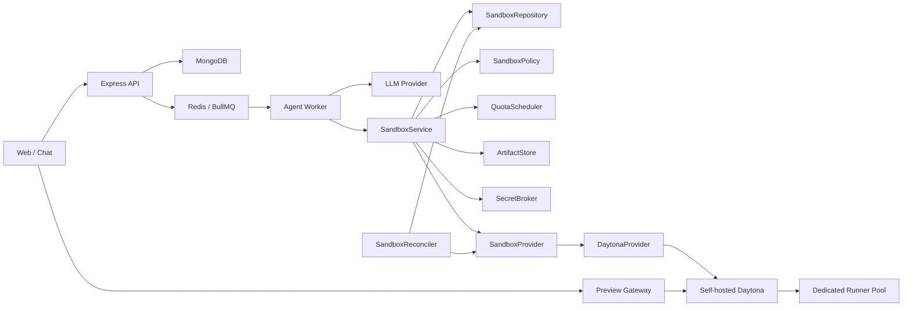

# Daytona Sandbox Provider、Branch 与分层配额设计

**日期：** 2026-07-26
**状态：** 书面规格已确认，进入分阶段实施计划

## 1. 背景

当前 Agent Worker 在宿主机临时目录中写入模型生成文件，并直接通过 Node.js 子进程执行依赖安装、TypeScript 检查和生产构建。现有实现已经具备路径校验、命令超时、输出限制和环境变量白名单，但它没有提供面向不可信生成代码的内核级隔离、CPU/内存/磁盘硬限制、出站网络策略和独立资源生命周期。

本项目的长期定位是帮助团队搭建和运营自己的 v0 式 AI App Builder。对企业内部单组织部署而言，平台成员可以视为可信用户，但模型生成代码、第三方 npm 依赖及其安装脚本仍然是不可信输入。因此，真实构建和运行预览必须从 API Server 和 Agent Worker 宿主机迁移到受控 Sandbox。

首个生产 Sandbox Provider 采用自托管 Daytona。Daytona Cloud 保持协议兼容，但不作为首版部署基线。

## 2. 目标

- 使用自托管 Daytona 隔离依赖安装、类型检查、生产构建和远程 Preview。
- 保持 Agent Orchestrator、BullMQ、SSE 和项目领域模型不依赖 Daytona SDK。
- 支持 Worker 重启后的 Sandbox 重连、幂等创建和资源回收。
- 将 Project 代码版本建模为可独立演进的 Branch。
- 让 Chat 关联 Branch，让 AgentRun 固定基于 Branch Head 执行。
- 将 Snapshot 作为永久逻辑版本保存到 ArtifactStore，不依赖常驻 Sandbox。
- 支持相同 Snapshot 的只读 Preview 共享和按需重建。
- 在 Branch、Project 和 Workspace 三层实施并发与资源配额。
- Preview 超出配额时，优先回收没有活跃 Session 且最久未访问的实例。
- 为未来接入其他 Sandbox Provider 保留稳定扩展边界。

## 3. 非目标

首版不包含：

- 用户可操作的通用终端。
- 任意 Agent shell 工具。
- 持久化云开发环境。
- Sandbox 文件变更自动写回 Project Snapshot。
- 跨 Workspace Preview 共享。
- Daytona Snapshot 或 Volume 作为项目唯一存储。
- 多个生产 Sandbox Provider 之间的自动调度。
- 任意全栈 Node Preview。
- 面向公网匿名用户的 Sandbox 执行。
- 将 SandboxService 立即拆分成独立微服务。

## 4. 已确认的关键决策

1. 自托管 Daytona 是首个生产 Provider。
2. 首版 Sandbox 范围是构建校验和远程运行预览。
3. 采用进程内 `SandboxService + SandboxProvider Adapter`，未来可独立拆分。
4. `SandboxProvider` 使用可移植核心协议和可选 Capability，不暴露 Daytona 业务细节。
5. Build Sandbox 和 Preview Sandbox 分离。
6. ArtifactStore 是源码、候选代码、历史 Snapshot、构建产物和日志的事实来源。
7. Project 可以包含多个 ProjectBranch，Chat 关联 Branch。
8. 每个 Branch 最多一个写入型 AgentRun、一个 Build Sandbox 和一个 Current Preview Binding。
9. Project 默认最多两个并行 Build、三个运行中 Preview。
10. Workspace 设置跨 Project 的全局数量和资源配额。
11. 相同 Snapshot 和 Runtime Fingerprint 可以共享只读 Preview。
12. Preview 使用企业同根域下的独立子域：`p-{deploymentId}.preview.ai.company.com`。
13. Preview 创建失败或等待配额不影响已经验证并提交的 AgentRun 成功状态。

## 5. 总体架构



### 5.1 Agent Worker

Agent Worker 继续负责模型调用、文件操作、错误分类、修复循环和 Snapshot 提交。它不直接依赖 Daytona SDK，也不直接管理 Preview URL。

### 5.2 SandboxService

SandboxService 是应用层唯一的 Sandbox 入口，负责：

- 将 AgentRun、Branch 和 Snapshot 转换为基础设施请求。
- 调用 QuotaScheduler 预留容量。
- 调用 SandboxProvider 创建和恢复 Sandbox。
- 从 ArtifactStore 上传源码或构建产物。
- 执行受 SandboxPolicy 允许的固定命令。
- 创建 PreviewDeployment 和 PreviewSession。
- 管理 Lease、心跳、取消和销毁。

首版 SandboxService 位于 `apps/server` 内部，但其 API 不依赖 Express、BullMQ 或 Daytona，可以在未来拆成独立服务。

### 5.3 SandboxProvider

SandboxProvider 是基础设施协议。它只理解 Sandbox、资源、文件、进程、网络和端口，不理解 Chat、Branch Head、Agent 修复和 Preview 共享规则。

### 5.4 ArtifactStore

ArtifactStore 永久保存：

- 模型生成后的 Candidate Artifact。
- 已提交的 Project Snapshot。
- Build 输出。
- 命令完整日志。
- Preview 使用的静态 `dist` Artifact。

Daytona 文件系统、Snapshot 和 Volume 都不能成为这些数据的唯一副本。

### 5.5 Preview Gateway

Preview Gateway：

- 验证平台用户和 PreviewSession。
- 根据 PreviewDeployment 找到 Daytona 私有 Endpoint。
- 删除平台 Cookie、Authorization 和内部身份 Header。
- 代理 HTTP 和必要的 WebSocket 流量。
- 不允许客户端指定任意 upstream URL。

## 6. ProjectBranch 与版本模型

### 6.1 Workspace 边界

Workspace 是权限和全局 Sandbox 配额边界：

```ts
interface Workspace {
  id: string
  name: string
  status: "active" | "suspended"
  executionLimits: WorkspaceExecutionLimits
  createdAt: Date
  updatedAt: Date
}

interface WorkspaceMember {
  workspaceId: string
  userId: string
  role: "owner" | "admin" | "member"
  createdAt: Date
}
```

Project 增加 `workspaceId`，同时保留当前 `userId`/owner 权限语义。首版访问 Project 必须同时满足：

1. 用户是对应 Workspace 的有效成员。
2. 用户通过现有 Project owner 权限检查。

首版不因引入 Workspace 自动开放 Workspace 内所有 Project。团队项目共享和更细的 Project RBAC 作为独立能力处理。

### 6.2 ProjectBranch

```ts
interface ProjectBranch {
  id: string
  workspaceId: string
  projectId: string

  name: string
  status: "active" | "archived"

  headSnapshotId?: string
  headVersion: number
  createdFromSnapshotId?: string

  createdAt: Date
  updatedAt: Date
}
```

Chat 关联 Branch：

```ts
interface Chat {
  projectId: string
  branchId: string
}
```

多个 Chat 可以关联同一个 Branch。需要独立演进代码时，从某个 Snapshot 创建新 Branch。

### 6.3 AgentRun 的 Branch 基线

```ts
interface AgentRunBranchContext {
  workspaceId: string
  projectId: string
  branchId: string

  baseSnapshotId?: string
  baseHeadVersion: number
  resultSnapshotId?: string
}
```

AgentRun 启动时固定记录 Branch Head 和版本。成功后通过 compare-and-set 更新 Branch：

```text
UPDATE branch
SET headSnapshotId = resultSnapshotId,
    headVersion = headVersion + 1
WHERE id = branchId
  AND headVersion = baseHeadVersion
```

如果更新失败：

- Result Snapshot 仍然永久保存。
- Run 进入 `completed_with_conflict`。
- 不覆盖当前 Branch Head。
- 后续可以从 Result Snapshot 创建新 Branch，或重新应用变更。

### 6.4 BranchExecutionLease

每个 Branch 最多一个执行中的写入型 AgentRun：

```ts
interface BranchExecutionLease {
  branchId: string
  runId: string
  baseHeadVersion: number

  acquiredAt: Date
  heartbeatAt: Date
  expiresAt: Date
}
```

BranchExecutionLease 从读取 Head、开始生成前获取，到成功提交、失败或取消后释放。即使 Lease 异常失效，Branch Head CAS 仍是最后一道并发保护。

## 7. Artifact 模型

### 7.1 Candidate Artifact

模型生成或修复完成后，必须先保存候选代码，再创建远程 Build Sandbox：

```ts
interface RunCandidateArtifact {
  id: string

  workspaceId: string
  projectId: string
  branchId: string
  runId: string

  baseSnapshotId?: string
  repairAttempt: number

  artifactRef: ArtifactRef
  contentDigest: string
  createdAt: Date
}
```

如果 Sandbox 丢失，Worker 从 Candidate Artifact 重建环境，不重新调用模型。

### 7.2 Artifact Manifest

```ts
interface ArtifactManifest {
  digest: string
  contentType: string
  byteSize: number
  fileCount?: number
  createdByRunId?: string
  createdAt: Date
}
```

Artifact 使用内容摘要校验，上传后重新计算 digest。所有压缩包必须限制总大小、文件数和单文件大小，并拒绝绝对路径、路径穿越、符号链接逃逸和压缩炸弹。

## 8. SandboxProvider 协议

### 8.1 控制面

```ts
interface SandboxProvider {
  readonly kind: string

  describe(): Promise<SandboxProviderDescriptor>

  create(spec: SandboxSpec): Promise<SandboxRef>
  connect(ref: SandboxRef): Promise<SandboxHandle>
  inspect(ref: SandboxRef): Promise<SandboxInspection>
  list(filter: SandboxListFilter): Promise<SandboxRef[]>

  destroy(
    ref: SandboxRef,
    options?: { wait?: boolean }
  ): Promise<SandboxDestroyReceipt>
}

interface SandboxRef {
  provider: string
  externalId: string
}
```

MongoDB 不存 Daytona SDK 对象、管理 URL、访问 Token 或完整 Provider 响应。

### 8.2 SandboxSpec

```ts
interface SandboxSpec {
  provisioningKey: string
  ownership: SandboxOwnership

  runtime: {
    image: SandboxImageRef
    workingDirectory: string
  }

  resources: {
    cpu: number
    memoryMiB: number
    diskMiB: number
  }

  networkPolicy: NetworkPolicy

  lifecycle: {
    leaseSeconds: number
    autoStopSeconds?: number
    autoDeleteSeconds: number
  }

  labels: Record<string, string>
}

interface SandboxOwnership {
  workspaceId: string
  projectId: string
  branchId: string

  runId?: string
  snapshotId?: string

  purpose: "build" | "preview"
}
```

推荐的 provisioning key：

```text
sandbox:{runId-or-snapshotId}:{purpose}:{attempt}
```

所有 Daytona 资源至少携带以下标签：

```text
managed-by=open-v0
workspace-id={workspaceId}
project-id={projectId}
branch-id={branchId}
run-id={runId}
snapshot-id={snapshotId}
purpose={build|preview}
provisioning-key={key}
```

### 8.3 SandboxHandle

```ts
interface SandboxHandle {
  readonly ref: SandboxRef

  waitUntilReady(options?: {
    timeoutMs?: number
  }): Promise<void>

  files: SandboxFileSystem
  processes: SandboxProcesses
  lifecycle: SandboxLifecycle

  preview?: SandboxPreview
  network?: SandboxNetworkControl
  checkpoints?: SandboxCheckpoints
}
```

文件、进程和生命周期是生产 Provider 的核心能力。Preview、运行时网络调整和 Provider Checkpoint 由 Capability 控制。

### 8.4 文件系统

```ts
interface SandboxFileSystem {
  uploadArchive(input: {
    artifact: ArtifactRef
    destination: string
    overwrite: boolean
  }): Promise<void>

  downloadArchive(input: {
    source: string
  }): Promise<ArtifactRef>

  writeFiles(files: Array<{
    path: string
    content: Uint8Array
    mode?: number
  }>): Promise<void>

  readFile(path: string): Promise<Uint8Array>
}
```

压缩包传输是项目级文件传输的主要方式；单文件接口用于增量修复。所有路径在进入 Provider 前执行工作目录约束和路径逃逸检查。

### 8.5 命令与进程

```ts
interface CommandSpec {
  executable: string
  args: string[]
  cwd: string

  environment?: Record<string, string>
  secretRefs?: SecretRef[]

  timeoutMs: number
  outputLimitBytes: number
}

interface CommandResult {
  exitCode: number | null
  signal?: string
  startedAt: Date
  completedAt: Date
  durationMs: number

  stdout: LogArtifact
  stderr: LogArtifact
  truncated: boolean
}

interface SandboxProcesses {
  exec(spec: CommandSpec): Promise<CommandResult>
  start(spec: CommandSpec): Promise<ProcessRef>
  inspect(ref: ProcessRef): Promise<ProcessInspection>
  streamLogs(
    ref: ProcessRef,
    cursor?: string
  ): AsyncIterable<ProcessLogChunk>
  stop(
    ref: ProcessRef,
    options?: { gracePeriodMs?: number }
  ): Promise<void>
}
```

平台接口始终使用 `executable + args`。DaytonaProvider 负责安全映射到 Daytona Process API。模型输出不能直接控制 executable、工作目录和环境变量。

### 8.6 网络

```ts
interface NetworkPolicy {
  defaultAction: "deny" | "allow"
  allowedDomains?: string[]
  allowedCidrs?: string[]
}

interface SandboxNetworkControl {
  apply(policy: NetworkPolicy): Promise<void>
}
```

Build 流程：

```text
registry allowlist
  → npm ci
  → deny-all
  → type-check
  → production build
```

Preview Sandbox 从创建开始保持 deny-all 出站网络。无法落实网络策略时必须 fail closed，不能静默降级。

### 8.7 Preview

```ts
interface SandboxPreview {
  exposePort(input: {
    port: number
    visibility: "private"
    ttlSeconds: number
  }): Promise<ProviderPreviewEndpoint>

  revoke(endpointId: string): Promise<void>
}

interface ProviderPreviewEndpoint {
  endpointId: string
  upstreamUrl: string
  accessToken?: SecretValue
  expiresAt: Date
}
```

ProviderPreviewEndpoint 只在 SandboxService 和 PreviewGateway 内部流转，浏览器永远不直接得到 Daytona URL 或 Token。

### 8.8 Capability

```ts
interface SandboxProviderDescriptor {
  kind: string
  protocolVersion: "sandbox-provider/v1"

  capabilities: {
    idempotentCreate: boolean
    reconnect: boolean
    listByLabels: boolean
    autoDelete: boolean

    archiveTransfer: boolean
    streamingLogs: boolean
    backgroundProcesses: boolean

    privatePreview: boolean
    signedPreview: boolean

    createTimeNetworkPolicy: boolean
    mutableNetworkPolicy: boolean
    domainAllowList: boolean
    denyAllNetwork: boolean

    providerSnapshots: boolean
    persistentVolumes: boolean
  }
}
```

SandboxService 在 Run 开始前进行能力预检。首版必需能力缺失时，Run 在创建 Sandbox 前失败。

首个 DaytonaProvider 的 Capability 要求：

| Capability | 要求 |
| --- | --- |
| idempotentCreate | 必需，可以由 Adapter 基于 provisioning key 实现 |
| reconnect | 必需 |
| listByLabels | 必需，用于崩溃恢复和 orphan 回收 |
| autoDelete | 必需，作为资源泄漏的最后安全网 |
| archiveTransfer | 必需 |
| streamingLogs | 必需 |
| backgroundProcesses | 必需 |
| privatePreview | 必需 |
| createTimeNetworkPolicy | 必需 |
| mutableNetworkPolicy | 必需，用于安装后收紧为 deny-all |
| domainAllowList | 必需 |
| denyAllNetwork | 必需 |
| providerSnapshots | 可选，仅用于性能优化 |
| persistentVolumes | 可选，仅用于缓存优化 |

## 9. SandboxLease

```ts
type SandboxPurpose = "build" | "preview"

type SandboxLeaseState =
  | "reserved"
  | "provisioning"
  | "ready"
  | "running"
  | "terminating"
  | "terminated"
  | "failed"
  | "lost"

interface SandboxLease {
  id: string

  workspaceId: string
  projectId: string
  branchId: string
  runId?: string
  snapshotId?: string

  purpose: SandboxPurpose

  provider: string
  externalId?: string
  provisioningKey: string

  state: SandboxLeaseState
  resourceProfile: ResourceProfile

  reservedAt: Date
  readyAt?: Date
  lastHeartbeatAt?: Date
  expiresAt: Date
  terminatedAt?: Date

  error?: SandboxSafeError
}
```

以下状态计入 Project 和 Workspace 配额：

```text
reserved
provisioning
ready
running
terminating
```

发送 Daytona delete 请求后 Lease 保持 `terminating`，直到确认资源不存在才进入 `terminated` 并释放配额。

## 10. PreviewDeployment、Binding 与 Session

### 10.1 PreviewDeployment

```ts
type PreviewDeploymentState =
  | "requested"
  | "waiting_for_capacity"
  | "provisioning"
  | "starting"
  | "ready"
  | "evicting"
  | "stopped"
  | "failed"

interface PreviewDeployment {
  id: string

  workspaceId: string
  projectId: string
  originBranchId: string

  snapshotId: string
  runtimeFingerprint: string

  sandboxLeaseId?: string
  state: PreviewDeploymentState
  endpointRef?: string

  activeSessionCount: number
  lastAccessedAt: Date
  expiresAt?: Date

  createdAt: Date
  updatedAt: Date
}
```

共享键：

```text
workspaceId + projectId + snapshotId + runtimeFingerprint
```

Runtime Fingerprint 包含 Runtime image、Node/package manager 版本、Preview 启动协议版本和影响运行结果的环境配置版本。

### 10.2 PreviewBinding

```ts
interface PreviewBinding {
  id: string

  workspaceId: string
  projectId: string
  branchId: string

  snapshotId: string
  deploymentId?: string

  isCurrent: boolean
  updatedAt: Date
}
```

`branchId + isCurrent=true` 建立唯一约束。Branch 提交新 Snapshot 时，Current Binding 切换到新 Snapshot；旧 Deployment 可以服务已有 Session，随后由 LRU 回收。

### 10.3 PreviewSession

```ts
interface PreviewSession {
  id: string

  workspaceId: string
  userId: string
  chatId?: string
  deploymentId: string

  createdAt: Date
  lastHeartbeatAt: Date
  expiresAt: Date
}
```

前端定期 heartbeat。过期 Session 自动失活。`activeSessionCount` 是查询优化字段，真正回收前必须再次检查有效 Session。

## 11. 分层配额

### 11.1 Branch 不变量

每个 Branch：

- 最多一个写入型 AgentRun。
- 最多一个资源占用状态的 Build SandboxLease。
- 最多一个 Current Preview Binding。

Branch 不限制历史 PreviewDeployment 的短暂存在；历史 Deployment 仍受 Project 和 Workspace 配额约束。

### 11.2 Project 默认配额

```ts
const defaultProjectQuota = {
  maxConcurrentBuilds: 2,
  maxRunningPreviews: 3,
}
```

### 11.3 Workspace 配额

```ts
interface SandboxQuota {
  maxConcurrentBuilds: number
  maxRunningPreviews: number

  maxCpu?: number
  maxMemoryMiB?: number
  maxDiskMiB?: number
}

interface WorkspaceExecutionLimits extends SandboxQuota {
  maxBuildsPerHour: number
  maxBuildMinutesPerDay: number

  maxArtifactBytes: number
  maxLogBytesPerCommand: number
  maxFilesPerSnapshot: number
}
```

Workspace 配额覆盖多个 Project，并作为最终成本和安全上限。

### 11.4 QuotaScheduler

所有容量分配通过 `QuotaScheduler.reserve()`：

1. 获取短期 Workspace 调度锁。
2. 检查 Branch 不变量。
3. 检查 Project 数量配额。
4. 检查 Workspace 数量和资源配额。
5. 在 MongoDB 创建 `reserved` SandboxLease。
6. 释放调度锁。
7. 在锁外调用 Daytona 创建资源。

Redis 锁只负责并发互斥，MongoDB 中的 Lease 是持久化事实。调度锁不覆盖耗时的 Sandbox 创建过程。

### 11.5 Preview 共享和回收

创建 Preview 前先按共享键查找 Ready Deployment。命中时只创建 Binding/Session，不增加 Sandbox 数量。

需要新建且超出配额时：

1. 只选择没有有效 PreviewSession 的 Deployment。
2. Project 超限时，先在当前 Project 内选择。
3. Workspace 超限时，在整个 Workspace 内选择。
4. 按 `lastAccessedAt` 从旧到新排序。
5. compare-and-set 将候选从 `ready` 改为 `evicting`。
6. 销毁 Sandbox，确认后进入 `stopped`。

如果所有候选都有活跃 Session，新 Deployment 保持 `waiting_for_capacity`，不强制中断正在使用的 Preview。

## 12. AgentRun 状态机

### 12.1 状态与阶段

```ts
type AgentRunStatus =
  | "queued"
  | "running"
  | "waiting_for_capacity"
  | "completed"
  | "completed_with_conflict"
  | "failed"
  | "cancelled"

type AgentRunPhase =
  | "planning"
  | "generating"
  | "persisting_candidate"
  | "waiting_for_build_slot"
  | "provisioning_sandbox"
  | "installing_dependencies"
  | "type_checking"
  | "building"
  | "repairing"
  | "committing_snapshot"
  | "requesting_preview"
```

主流程：

```text
queued
  → planning
  → generating
  → persisting_candidate
  → waiting_for_build_slot
  → provisioning_sandbox
  → installing_dependencies
  → type_checking
  → building
  → repairing（可选、有限次数）
  → committing_snapshot
  → completed / completed_with_conflict
```

Snapshot 提交后异步请求 Preview。Preview 等待配额或启动失败不会反向修改成功 Run。

### 12.2 取消

- 排队或等待容量：取消 Job，释放 BranchExecutionLease 和 reservation。
- 模型生成：记录 `cancelRequestedAt`，尝试中止模型流，不创建新 Sandbox。
- 构建期间：停止命令，请求销毁 Build Sandbox，确认后释放 Lease。
- Snapshot 已提交：不回滚 Branch Head，Run 保持 completed；只取消尚未创建的 Preview 请求。
- 共享 Preview 不因单个 Chat 或 Session 取消而销毁。

## 13. Build 与 Preview 数据流

### 13.1 Build

```text
读取 Branch Head
  → 获取 BranchExecutionLease
  → 调用模型
  → 应用文件操作
  → 保存 Candidate Artifact
  → 预留 Build 配额
  → 创建 Daytona Build Sandbox
  → 上传 Candidate Artifact
  → npm ci（registry allowlist）
  → 收紧为 deny-all
  → type-check
  → production build
  → 代码错误时有限修复
  → 保存 Build Artifact 和 Project Snapshot
  → CAS 更新 Branch Head
  → 销毁 Build Sandbox
  → 释放 BranchExecutionLease
```

### 13.2 Preview

当前 React/Vite 项目使用静态 Preview Runtime：

```text
验证通过的 dist Artifact
  → 查找可共享 PreviewDeployment
  → 必要时预留 Preview 配额
  → 创建 Daytona Preview Sandbox
  → 上传 dist Artifact
  → 使用平台内置静态服务器启动
  → deny-all 出站网络
  → Sandbox 内部端口健康检查
  → Preview Gateway 外部探测
  → Deployment ready
```

Preview 不执行生成项目提供的任意服务器启动命令。未来支持 Node/full-stack Runtime 时，必须使用新的 Runtime Profile、镜像、命令白名单和网络策略。

## 14. 错误模型

```ts
type SandboxErrorCode =
  | "CAPABILITY_UNAVAILABLE"
  | "CAPACITY_EXCEEDED"
  | "PROVISION_TIMEOUT"
  | "PROVIDER_UNAVAILABLE"
  | "SANDBOX_LOST"
  | "FILE_TRANSFER_FAILED"
  | "COMMAND_TIMEOUT"
  | "COMMAND_CANCELLED"
  | "NETWORK_POLICY_REJECTED"
  | "PREVIEW_START_FAILED"
  | "PREVIEW_HEALTHCHECK_FAILED"
  | "DESTROY_FAILED"

interface SandboxSafeError {
  code: SandboxErrorCode
  category:
    | "capacity"
    | "provider"
    | "policy"
    | "execution"
    | "preview"
  retryable: boolean
  safeMessage: string
  detailArtifactRef?: ArtifactRef
}
```

处理规则：

| 错误 | 处理 |
| --- | --- |
| `CAPACITY_EXCEEDED` | Run 或 Preview 等待容量 |
| `PROVIDER_UNAVAILABLE` | 基础设施退避重试，不调用模型 |
| `SANDBOX_LOST` | 从 Candidate/Build Artifact 重建 |
| `COMMAND_TIMEOUT` | 按阶段和重试预算处理 |
| `NETWORK_POLICY_REJECTED` | fail closed |
| Build 代码退出码非零 | 映射为现有 CODE_ERROR 或 DEPENDENCY_ERROR |
| Preview 启动失败 | PreviewDeployment failed，Run 保持 completed |

Provider 原始错误、内部地址、Token 和完整响应体不进入 SSE 或前端。

## 15. 幂等性与 Reconciler

### 15.1 创建幂等性

最危险的窗口是 Daytona 创建成功、MongoDB 尚未保存 externalId 时 Worker 崩溃。恢复规则：

1. 先创建 `reserved` SandboxLease。
2. Daytona create 携带 provisioning key 和 labels。
3. 成功后立即保存 externalId。
4. 重试时如果 externalId 为空，先按 provisioning key 查找 Daytona。
5. 找到唯一资源则重新关联。
6. 找到多个资源则保留与 Lease 关联或最早成功的一个，其余进入 orphan 回收。
7. 找不到才重新创建。

`destroy()` 必须幂等。资源已经不存在视为成功。

### 15.2 数据库到 Provider

Reconciler 周期检查资源占用状态的 Lease：

| 数据库状态 | Provider 状态 | 处理 |
| --- | --- | --- |
| reserved 超时且无 externalId | 无资源 | failed，释放配额 |
| provisioning | Ready | 更新 ready |
| provisioning 超时 | Creating | 请求删除 |
| ready/running | 不存在 | lost |
| terminating | 仍存在 | 重试 delete |
| terminating | 不存在 | terminated |
| terminated | 仍存在 | 重新删除并告警 |

### 15.3 Provider 到数据库

按 `managed-by=open-v0` 标签列出 Daytona 资源：

- 没有对应 Lease 的资源进入 orphan candidate。
- orphan 经过宽限期后仍无记录才删除。
- 同一 provisioning key 的重复资源只保留一个。
- 缺少平台标签的资源不自动删除，只记录告警。

### 15.4 Preview 专项恢复

- Ready Deployment 的进程死亡：标记 failed/stopped。
- Endpoint 失效但进程正常：重新注册 Endpoint。
- Session 全部过期：进入可回收集合。
- Sandbox 丢失且存在活跃 Session：高优先级重建。
- Sandbox 丢失且无 Session：保持 stopped，等待按需重建。
- Binding 指向 stopped Deployment：保留 Snapshot 指向，下次访问重建。

恢复优先级：

1. 正在提交 Snapshot 的 Build。
2. 有活跃 Session 的 Preview。
3. 正在验证的 Build。
4. 等待构建的 AgentRun。
5. 没有活跃 Session 的 Preview。
6. 历史 Preview 不主动恢复。

## 16. 自托管安全边界

### 16.1 Runner 隔离

Daytona 是 Sandbox 控制面，不代替底层运行时安全策略。Runner 必须：

- 使用独立节点池，不与 API、MongoDB 或 Redis 共用宿主机。
- 不挂载 Docker socket。
- 不使用包含平台源码或凭证的 host path。
- 禁止访问宿主机管理网络和平台数据网络。
- 使用独立低权限运行身份。
- 启用可用的 seccomp、AppArmor、rootless 或 VM 隔离。
- 设置 CPU、内存、磁盘和进程数硬限制。

如果底层使用共享内核容器，部署文档必须明确其安全等级。高隔离部署可以替换为 VM/microVM-backed Runner，不改变 Provider 协议。

### 16.2 Secret

Build Sandbox 不注入：

- Daytona 管理凭证。
- 模型 API Key。
- MongoDB、Redis 凭证。
- JWT Secret。
- 用户个人访问令牌。
- Workspace 业务系统凭证。

私有 npm registry 凭证必须只读、最小 scope、短 TTL，并仅在安装阶段有效。

### 16.3 Preview 同根域策略

平台和 Preview 使用企业同一根域，但保持不同 Origin：

```text
平台：
v0.ai.company.com

Preview：
p-{deploymentId}.preview.ai.company.com
```

部署要求：

- 企业内部 wildcard DNS：`*.preview.ai.company.com`。
- 对应 wildcard TLS 证书。
- 每个 PreviewDeployment 使用独立子域。
- 平台认证 Cookie 使用 `__Host-` 前缀、`Secure`、`Path=/`，不设置 `Domain`。
- 不使用 `.ai.company.com` 范围的共享平台认证 Cookie。
- Preview Gateway 不向 Sandbox 转发 Cookie、Authorization、SSO Header。
- 平台写操作校验 CSRF Token 和 Origin，不能只依赖 SameSite。
- Preview CSP 至少包含 `worker-src 'none'`，禁止 Service Worker。
- Preview iframe 禁止顶层导航平台管理页面。
- Preview upstream 只能来自已登记的 Daytona Endpoint。

如果企业统一 SSO 必须使用根域共享 Cookie，Preview Gateway 可以在入口消费身份信息，但必须在代理到 Sandbox 前删除相关 Cookie 和身份 Header。

“只读 Preview”表示运行时文件变更不会写回 ArtifactStore，Sandbox 销毁后变更丢弃。支持只读挂载时优先使用，但不把操作系统层只读作为首版正确性依赖。

## 17. 可观测性

每个 Sandbox 操作关联：

```text
workspaceId
projectId
branchId
runId / snapshotId
sandboxLeaseId
provider
externalId
provisioningKey
```

核心指标：

- Sandbox 创建成功率和 P50/P95/P99 延迟。
- Sandbox 泄漏和 orphan 数量。
- Build 排队时间。
- Project/Workspace 配额利用率。
- Preview 冷启动时间和共享命中率。
- Preview LRU 回收次数。
- Provider API 错误率。
- Reconciler 修复、重建和删除数量。
- Sandbox lost 数量。
- 每次 Run 的 CPU 时间和 Sandbox 存活时间。

日志禁止记录 Provider Token、Preview Token、Registry Credential、完整用户源码和未脱敏环境变量。

## 18. 测试策略

### 18.1 Provider Contract Test

所有 Provider 运行同一套合同测试：

- 创建、等待 Ready、重连和幂等创建。
- Archive 上传、下载和摘要验证。
- 命令成功、失败、超时和取消。
- 后台进程启动、日志和停止。
- deny-all 和 domain allowlist。
- 私有 Preview。
- 幂等销毁。
- list/inspect 和恢复。

### 18.2 Branch 与版本测试

- 两个 Chat 共享一个 Branch。
- 两个 Branch 独立演进。
- 同 Branch 的第二个写入 Run 必须等待。
- Branch Head CAS 阻止旧 Run 覆盖。
- 冲突 Run 的 Snapshot 仍然保留。
- 历史 Snapshot 可以重建 Preview。

### 18.3 配额并发测试

- 一个 Branch 不能出现两个 Build Lease。
- 一个 Project 最多两个并行 Build。
- 一个 Project 最多三个实际 Preview Sandbox。
- Workspace 配额覆盖多个 Project。
- 共享 Preview 只占一个配额。
- 并发请求相同 Snapshot 时只创建一个 Deployment。
- terminating Sandbox 继续占用配额。
- Redis 调度锁失效后不会突破已有 reservation。

### 18.4 Preview 回收测试

- 有有效 Session 的 Preview 不被回收。
- 无 Session 的最久未访问 Preview 优先回收。
- Project 超限时优先在当前 Project 内回收。
- Workspace 超限时可以跨 Project 回收。
- 所有 Preview 活跃时进入等待状态。
- 被回收后可以从 ArtifactStore 重建。
- 共享 Deployment 中关闭一个 Session 不会销毁 Preview。

### 18.5 故障注入

覆盖以下崩溃窗口：

- 写 reservation 后。
- Daytona create 成功、写 externalId 前。
- 上传 Artifact 期间。
- 命令运行期间。
- Snapshot 保存后、Branch CAS 前。
- delete 请求后、确认删除前。
- Preview Ready 后、Gateway 注册前。

### 18.6 安全测试

- 路径穿越、Zip Slip 和压缩炸弹。
- 命令参数注入。
- 日志 Secret 泄漏。
- Sandbox 访问 MongoDB、Redis 和管理网被拒绝。
- Preview 绕过鉴权和跨 Workspace 访问。
- Preview Gateway SSRF。
- Preview 读取平台认证信息。
- Preview 注册 Service Worker。
- 超大输出、fork bomb 和资源耗尽。

## 19. 分阶段落地

### Phase 1：Branch 与 Artifact

- 引入 Workspace 和 ProjectBranch。
- Chat 关联 Branch。
- AgentRun 记录 Branch、base Snapshot 和 base head version。
- 增加 BranchExecutionLease 和 Branch Head CAS。
- Candidate/Project Snapshot 迁移到 ArtifactStore。

数据迁移：

- 创建一个默认 Workspace。
- 将现有用户加入默认 Workspace，但保留 Project owner 访问规则。
- 将现有 Project 关联到默认 Workspace。
- 每个现有 Project 创建 `main` Branch。
- 现有 Chat 默认关联 `main`。
- `main.headSnapshotId` 指向项目当前最新成功 Snapshot。
- 首轮迁移不从历史 Chat 自动推断多个 Branch。

### Phase 2：Sandbox Core

- SandboxService。
- SandboxProvider。
- SandboxLease。
- QuotaScheduler。
- Fake/Local Provider 合同测试。
- Reconciler 基础框架。

### Phase 3：Daytona Build

- 自托管 DaytonaProvider。
- Archive 上传和日志 Artifact。
- 固定构建命令。
- 网络策略。
- Build Sandbox 重建。
- 替换当前宿主机校验工作区。

### Phase 4：Preview

- PreviewDeployment、PreviewBinding 和 PreviewSession。
- 静态 Preview Runtime。
- Preview Gateway。
- 企业同根域 wildcard Preview 子域。
- Snapshot 共享。
- Project/Workspace 配额和 LRU 回收。

### Phase 5：生产加固

- 完整故障注入。
- 配额和资源计量。
- 安全基线验证。
- Provider 运行指标。
- Daytona Snapshot 缓存优化。
- 管理员查看和强制回收入口。

### 实施计划拆分

本文是跨阶段的总体架构规格，不应作为一个超大改动一次实施。每个 Phase 使用独立实施计划和验收门：

1. Workspace、ProjectBranch、Chat/AgentRun 版本语义。
2. ArtifactStore、Candidate Artifact 和 Snapshot 迁移。
3. Sandbox Core、Lease、QuotaScheduler 和 Reconciler。
4. Daytona Build Provider。
5. PreviewDeployment、Gateway、共享和 LRU。
6. 生产加固与故障注入。

书面规格审阅通过后的第一个实施计划只覆盖第 1 项；后续计划以前一阶段验收通过为前提。

## 20. 验收标准

设计实现完成后，至少满足：

1. 生成代码和 npm 安装脚本不再运行于 API/Worker 宿主机。
2. Worker 在 Daytona create 后任意崩溃都不会永久泄漏 Sandbox。
3. Sandbox 丢失后可以从 Candidate/Build Artifact 恢复，不重新调用模型。
4. 同 Branch 不会并发提交两个代码版本。
5. 不同 Branch 可以在 Project 配额允许时并行构建。
6. 相同 Snapshot 的并发 Preview 请求只创建一个实际 Sandbox。
7. Preview 超限时只回收无有效 Session 的 LRU 实例。
8. 历史 Snapshot 在 Preview 被回收后仍能按需重建。
9. Preview 等待容量或启动失败不改变已成功 AgentRun 的状态。
10. 平台浏览器只能访问通过 Preview Gateway 鉴权的 Preview。
11. Preview Sandbox 无法访问平台数据网和管理网。
12. Daytona 管理凭证和平台 Secret 不进入生成代码执行环境。
13. Provider Contract、配额并发、故障注入和安全测试通过。

## 21. 参考资料

- [Daytona Sandboxes](https://www.daytona.io/docs/en/sandboxes/)
- [Daytona TypeScript SDK: Process](https://www.daytona.io/docs/en/typescript-sdk/process/)
- [Daytona TypeScript SDK: File System](https://www.daytona.io/docs/en/typescript-sdk/file-system/)
- [Daytona Network Limits](https://www.daytona.io/docs/en/network-limits/)
- [Daytona Preview](https://www.daytona.io/docs/en/preview/)
- [Daytona Persistence](https://www.daytona.io/docs/en/persistence/)
